# 目標
- EC2, ELB, RDSを使用ã™ã‚‹
- ウェブサービスè¦æ¨¡ã«åˆã‚ã›ã¦ã€æŸ”軟ã«ã‚·ã‚¹ãƒ†ãƒ æ‹¡å¼µã™ã‚‹
- CLoudFormationã§ã‚½ãƒ¼ã‚¹ã‚³ãƒ¼ãƒ‰åŒ–

# å‰ææ¡ä»¶
- ãƒãƒ³ã‚ºã‚ªãƒ³ç”¨ã®æ–°ã—ã„AWSアカウントを用æ„ã™ã‚‹
- AdministratorAccess 

# 今å›ä½œæˆã—ãŸã®ãƒªã‚½ãƒ¼ã‚¹ã®IaC
<details><summary>CloudFormationã§ç”Ÿæˆã•ã‚ŒãŸã‚³ãƒ¼ãƒ‰</summary>

```yaml
---
Metadata:
  TemplateId: "arn:aws:cloudformation:ap-northeast-1:975050180086:generatedTemplate/f0ee5e3d-3dfd-4491-b22c-226d5bf5cbe9"
Parameters:
  RDSDBSubnetGroup00dbsubneteg0100JPV1eSubnetIdsPLU9f:
    NoEcho: "true"
    Type: "CommaDelimitedList"
    Description: "The EC2 Subnet IDs for the DB subnet group."
Resources:
  EC2SubnetRouteTableAssociation00rtbassoc08001bc623df9901e00tbeyY:
    UpdateReplacePolicy: "Retain"
    Type: "AWS::EC2::SubnetRouteTableAssociation"
    DeletionPolicy: "Retain"
    Properties:
      RouteTableId:
        Ref: "EC2RouteTable00rtb066f12bf0d551dc1a00vY9x7"
      SubnetId:
        Ref: "EC2Subnet00subnet09bb46ec4214fe4d600wHHaf"
  EC2Route00rtb066f12bf0d551dc1a00p3lw7:
    UpdateReplacePolicy: "Retain"
    Type: "AWS::EC2::Route"
    DeletionPolicy: "Retain"
    Properties:
      RouteTableId:
        Ref: "EC2RouteTable00rtb066f12bf0d551dc1a00vY9x7"
      DestinationCidrBlock: "0.0.0.0/0"
      GatewayId:
        Ref: "EC2InternetGateway00igw0278210f906044a7400f3Rff"
      VpcEndpointId: "igw-0278210f906044a74"
  EC2NetworkAcl00acl00eb3611e9564542500Mhtws:
    UpdateReplacePolicy: "Retain"
    Type: "AWS::EC2::NetworkAcl"
    DeletionPolicy: "Retain"
    Properties:
      VpcId:
        Ref: "EC2VPC00vpc050d0e7e9e4cfb65f004iTrI"
      Tags: []
  EC2SecurityGroup00sg09cae9034f4c8620400e13Rv:
    UpdateReplacePolicy: "Retain"
    Type: "AWS::EC2::SecurityGroup"
    DeletionPolicy: "Retain"
    Properties:
      GroupDescription: "db-user01"
      GroupName: "db-user01"
      VpcId:
        Ref: "EC2VPC00vpc050d0e7e9e4cfb65f004iTrI"
      SecurityGroupIngress:
      - IpProtocol: "tcp"
        FromPort: 3306
        SourceSecurityGroupId: "sg-025dda26fe02ebf78"
        ToPort: 3306
        SourceSecurityGroupOwnerId: "975050180086"
      SecurityGroupEgress:
      - CidrIp: "0.0.0.0/0"
        IpProtocol: "-1"
        FromPort: -1
        ToPort: -1
  EC2VolumeAttachment00vol051b7f45546f2628700eoj3x:
    UpdateReplacePolicy: "Retain"
    Type: "AWS::EC2::VolumeAttachment"
    DeletionPolicy: "Retain"
    Properties:
      InstanceId: "i-0a7b24f9bcb93c723"
      VolumeId: "vol-051b7f45546f26287"
      Device: "/dev/xvda"
  EC2RouteTable00rtb066f12bf0d551dc1a00vY9x7:
    UpdateReplacePolicy: "Retain"
    Type: "AWS::EC2::RouteTable"
    DeletionPolicy: "Retain"
    Properties:
      VpcId:
        Ref: "EC2VPC00vpc050d0e7e9e4cfb65f004iTrI"
      Tags:
      - Value: "project-eg1-rtb-public"
        Key: "Name"
  EC2NetworkInterface00eni0f22d2e4b1c9691a5008hsdS:
    UpdateReplacePolicy: "Retain"
    Type: "AWS::EC2::NetworkInterface"
    DeletionPolicy: "Retain"
    Properties:
      Description: ""
      PrivateIpAddress: "10.0.0.250"
      PrivateIpAddresses:
      - PrivateIpAddress: "10.0.0.250"
        Primary: true
      SecondaryPrivateIpAddressCount: 0
      Ipv6PrefixCount: 0
      Ipv4Prefixes: []
      Ipv4PrefixCount: 0
      GroupSet:
      - "sg-025dda26fe02ebf78"
      Ipv6Prefixes: []
      SubnetId:
        Ref: "EC2Subnet00subnet09bb46ec4214fe4d600wHHaf"
      SourceDestCheck: true
      InterfaceType: "interface"
      Tags: []
  EC2VPC00vpc050d0e7e9e4cfb65f004iTrI:
    UpdateReplacePolicy: "Retain"
    Type: "AWS::EC2::VPC"
    DeletionPolicy: "Retain"
    Properties:
      CidrBlock: "10.0.0.0/16"
      EnableDnsSupport: true
      InstanceTenancy: "default"
      EnableDnsHostnames: true
      Tags:
      - Value: "project-eg1-vpc"
        Key: "Name"
  EC2SubnetNetworkAclAssociation00aclassoc0011b3581cfe8b98300nupXo:
    UpdateReplacePolicy: "Retain"
    Type: "AWS::EC2::SubnetNetworkAclAssociation"
    DeletionPolicy: "Retain"
    Properties:
      NetworkAclId:
        Ref: "EC2NetworkAcl00acl00eb3611e9564542500Mhtws"
      SubnetId:
        Ref: "EC2Subnet00subnet0f65727d2f08bb9ed00q6ETp"
  RDSDBSubnetGroup00dbsubneteg0100JPV1e:
    UpdateReplacePolicy: "Retain"
    Type: "AWS::RDS::DBSubnetGroup"
    DeletionPolicy: "Retain"
    Properties:
      SubnetIds:
        Ref: "RDSDBSubnetGroup00dbsubneteg0100JPV1eSubnetIdsPLU9f"
      DBSubnetGroupDescription: "db-subnet-eg01"
      DBSubnetGroupName: "db-subnet-eg01"
  EC2Instance00i0ac76abcc9676047c00Db5os:
    UpdateReplacePolicy: "Retain"
    Type: "AWS::EC2::Instance"
    DeletionPolicy: "Retain"
    Properties:
      Tenancy: "default"
      SecurityGroups:
      - "web-eg01"
      PrivateIpAddress: "10.0.1.209"
      InstanceInitiatedShutdownBehavior: "stop"
      CpuOptions:
        ThreadsPerCore: 1
        CoreCount: 1
      BlockDeviceMappings:
      - Ebs:
          SnapshotId: "snap-0ac7a2a93d0648960"
          VolumeType: "gp2"
          Iops: 100
          VolumeSize: 8
          Encrypted: false
          DeleteOnTermination: true
        DeviceName: "/dev/xvda"
      AvailabilityZone: "ap-northeast-1c"
      PrivateDnsNameOptions:
        EnableResourceNameDnsARecord: false
        HostnameType: "ip-name"
        EnableResourceNameDnsAAAARecord: false
      SubnetId:
        Ref: "EC2Subnet00subnet024e0b0fab4658e9c00d94Ch"
      SecurityGroupIds:
      - "sg-025dda26fe02ebf78"
      EbsOptimized: false
      DisableApiTermination: false
      SourceDestCheck: true
      Volumes:
      - VolumeId: "vol-00137c92da80cf1ae"
        Device: "/dev/xvda"
      PlacementGroupName: ""
      VpcId: "vpc-050d0e7e9e4cfb65f"
      State:
        Code: "16"
        Name: "running"
      NetworkInterfaces:
      - PrivateIpAddresses:
        - PrivateIpAddress: "10.0.1.209"
          Primary: true
        SecondaryPrivateIpAddressCount: 0
        DeviceIndex: "0"
        GroupSet:
        - Ref: "EC2SecurityGroup00sg025dda26fe02ebf7800TvmTn"
        Ipv6Addresses: []
        SubnetId:
          Ref: "EC2Subnet00subnet024e0b0fab4658e9c00d94Ch"
        AssociatePublicIpAddress: true
        NetworkInterfaceId:
          Ref: "EC2NetworkInterface00eni0617688fff03f3b2f00MPU23"
        DeleteOnTermination: true
      ImageId: "ami-0adb57ece3fccbca2"
      InstanceType: "t2.micro"
      Monitoring: false
      Tags:
      - Value: "webserver#2-eg01"
        Key: "Name"
      CreditSpecification:
        CPUCredits: "standard"
  RDSDBInstance00rdseg0100m5eJw:
    UpdateReplacePolicy: "Retain"
    Type: "AWS::RDS::DBInstance"
    DeletionPolicy: "Retain"
    Properties:
      StorageEncrypted: true
      AssociatedRoles: []
      CertificateDetails: {}
      ProcessorFeatures: []
      StorageThroughput: 0
      PreferredBackupWindow: "18:38-19:08"
      MonitoringInterval: 0
      DBParameterGroupName: "default.mysql8.0"
      Endpoint: {}
      NetworkType: "IPV4"
      DedicatedLogVolume: false
      CopyTagsToSnapshot: true
      MultiAZ: true
      Engine: "mysql"
      Tags: []
      LicenseModel: "general-public-license"
      EngineVersion: "8.0.35"
      StorageType: "gp2"
      KmsKeyId:
        Fn::GetAtt:
        - "KMSKey00db63a7fdf9744d1f9e226ffad93f6b9800BGFUz"
        - "Arn"
      DBInstanceClass: "db.t3.micro"
      AvailabilityZone: "ap-northeast-1a"
      OptionGroupName: "default:mysql-8-0"
      PreferredMaintenanceWindow: "sun:15:00-sun:15:30"
      EnablePerformanceInsights: false
      AutoMinorVersionUpgrade: true
      DBSubnetGroupName:
        Ref: "RDSDBSubnetGroup00dbsubneteg0100JPV1e"
      DeletionProtection: false
      DBInstanceIdentifier: "rds-eg01"
      AllocatedStorage: "20"
      CACertificateIdentifier: "rds-ca-rsa2048-g1"
      ManageMasterUserPassword: false
      MasterUserSecret: {}
      VPCSecurityGroups:
      - Fn::GetAtt:
        - "EC2SecurityGroup00sg09cae9034f4c8620400e13Rv"
        - "GroupId"
      DBSecurityGroups: []
      MasterUsername: "admin"
      DBName: "Wordpress"
      EnableIAMDatabaseAuthentication: false
      MaxAllocatedStorage: 1000
      BackupRetentionPeriod: 0
      PubliclyAccessible: false
      EnableCloudwatchLogsExports: []
  EC2SubnetNetworkAclAssociation00aclassoc0067af7ea3d8ca22400c9qGG:
    UpdateReplacePolicy: "Retain"
    Type: "AWS::EC2::SubnetNetworkAclAssociation"
    DeletionPolicy: "Retain"
    Properties:
      NetworkAclId:
        Ref: "EC2NetworkAcl00acl00eb3611e9564542500Mhtws"
      SubnetId:
        Ref: "EC2Subnet00subnet0eae5af9f6788716b00XIx3c"
  EC2NetworkInterface00eni0fbea3406f44ea03e00jrE5J:
    UpdateReplacePolicy: "Retain"
    Type: "AWS::EC2::NetworkInterface"
    DeletionPolicy: "Retain"
    Properties:
      Description: "RDSNetworkInterface"
      PrivateIpAddress: "10.0.2.139"
      PrivateIpAddresses:
      - PrivateIpAddress: "10.0.2.139"
        Primary: true
      SecondaryPrivateIpAddressCount: 0
      Ipv6PrefixCount: 0
      Ipv4Prefixes: []
      Ipv4PrefixCount: 0
      GroupSet:
      - "sg-09cae9034f4c86204"
      Ipv6Prefixes: []
      SubnetId:
        Ref: "EC2Subnet00subnet0eae5af9f6788716b00XIx3c"
      SourceDestCheck: true
      InterfaceType: "interface"
      Tags: []
  EC2SubnetRouteTableAssociation00rtbassoc0a1454101738920fd00dKTo8:
    UpdateReplacePolicy: "Retain"
    Type: "AWS::EC2::SubnetRouteTableAssociation"
    DeletionPolicy: "Retain"
    Properties:
      RouteTableId:
        Ref: "EC2RouteTable00rtb066f12bf0d551dc1a00vY9x7"
      SubnetId:
        Ref: "EC2Subnet00subnet024e0b0fab4658e9c00d94Ch"
  KMSKey00db63a7fdf9744d1f9e226ffad93f6b9800BGFUz:
    UpdateReplacePolicy: "Retain"
    Type: "AWS::KMS::Key"
    DeletionPolicy: "Retain"
    Properties:
      Origin: "AWS_KMS"
      MultiRegion: false
      Description: "Default key that protects my RDS database volumes when no other\
        \ key is defined"
      KeyPolicy:
        Version: "2012-10-17"
        Statement:
        - Condition:
            StringEquals:
              kms:CallerAccount: "975050180086"
              kms:ViaService: "rds.ap-northeast-1.amazonaws.com"
          Resource: "*"
          Action:
          - "kms:Encrypt"
          - "kms:Decrypt"
          - "kms:ReEncrypt*"
          - "kms:GenerateDataKey*"
          - "kms:CreateGrant"
          - "kms:ListGrants"
          - "kms:DescribeKey"
          Effect: "Allow"
          Principal:
            AWS: "*"
          Sid: "Allow access through RDS for all principals in the account that are\
            \ authorized to use RDS"
        - Resource: "*"
          Action:
          - "kms:Describe*"
          - "kms:Get*"
          - "kms:List*"
          - "kms:RevokeGrant"
          Effect: "Allow"
          Principal:
            AWS: "arn:aws:iam::975050180086:root"
          Sid: "Allow direct access to key metadata to the account"
        Id: "auto-rds-2"
      KeySpec: "SYMMETRIC_DEFAULT"
      Enabled: true
      EnableKeyRotation: false
      KeyUsage: "ENCRYPT_DECRYPT"
      Tags: []
  EC2SubnetNetworkAclAssociation00aclassoc0e499f72075071155001Ph67:
    UpdateReplacePolicy: "Retain"
    Type: "AWS::EC2::SubnetNetworkAclAssociation"
    DeletionPolicy: "Retain"
    Properties:
      NetworkAclId:
        Ref: "EC2NetworkAcl00acl00eb3611e9564542500Mhtws"
      SubnetId:
        Ref: "EC2Subnet00subnet024e0b0fab4658e9c00d94Ch"
  EC2RouteTable00rtb09e26ed041c34f6b1003BpfG:
    UpdateReplacePolicy: "Retain"
    Type: "AWS::EC2::RouteTable"
    DeletionPolicy: "Retain"
    Properties:
      VpcId:
        Ref: "EC2VPC00vpc050d0e7e9e4cfb65f004iTrI"
      Tags:
      - Value: "project-eg1-rtb-private1-ap-northeast-1a"
        Key: "Name"
  EC2VolumeAttachment00vol00137c92da80cf1ae00XA6Cg:
    UpdateReplacePolicy: "Retain"
    Type: "AWS::EC2::VolumeAttachment"
    DeletionPolicy: "Retain"
    Properties:
      InstanceId: "i-0ac76abcc9676047c"
      VolumeId: "vol-00137c92da80cf1ae"
      Device: "/dev/xvda"
  EC2NetworkInterface00eni0f1eae239f7a7aca700GWn14:
    UpdateReplacePolicy: "Retain"
    Type: "AWS::EC2::NetworkInterface"
    DeletionPolicy: "Retain"
    Properties:
      Description: "ELB app/elb-eg01/952db96929c35303"
      PrivateIpAddress: "10.0.1.216"
      PrivateIpAddresses:
      - PrivateIpAddress: "10.0.1.216"
        Primary: true
      SecondaryPrivateIpAddressCount: 0
      Ipv6PrefixCount: 0
      Ipv4Prefixes: []
      Ipv4PrefixCount: 0
      GroupSet:
      - "sg-0d3bbc33a6e6d254a"
      Ipv6Prefixes: []
      SubnetId:
        Ref: "EC2Subnet00subnet024e0b0fab4658e9c00d94Ch"
      SourceDestCheck: true
      InterfaceType: "interface"
      Tags: []
  EC2SubnetRouteTableAssociation00rtbassoc0220a7aa5b8976ffe00qKG9M:
    UpdateReplacePolicy: "Retain"
    Type: "AWS::EC2::SubnetRouteTableAssociation"
    DeletionPolicy: "Retain"
    Properties:
      RouteTableId:
        Ref: "EC2RouteTable00rtb09e26ed041c34f6b1003BpfG"
      SubnetId:
        Ref: "EC2Subnet00subnet0eae5af9f6788716b00XIx3c"
  EC2Subnet00subnet024e0b0fab4658e9c00d94Ch:
    UpdateReplacePolicy: "Retain"
    Type: "AWS::EC2::Subnet"
    DeletionPolicy: "Retain"
    Properties:
      VpcId:
        Ref: "EC2VPC00vpc050d0e7e9e4cfb65f004iTrI"
      MapPublicIpOnLaunch: false
      EnableDns64: false
      AvailabilityZoneId: "apne1-az1"
      PrivateDnsNameOptionsOnLaunch:
        EnableResourceNameDnsARecord: false
        HostnameType: "ip-name"
        EnableResourceNameDnsAAAARecord: false
      CidrBlock: "10.0.1.0/24"
      Ipv6Native: false
      Tags:
      - Value: "project-public-1c"
        Key: "Name"
  EC2Instance00i0a7b24f9bcb93c72300lcuIO:
    UpdateReplacePolicy: "Retain"
    Type: "AWS::EC2::Instance"
    DeletionPolicy: "Retain"
    Properties:
      Tenancy: "default"
      SecurityGroups:
      - "web-eg01"
      PrivateIpAddress: "10.0.0.250"
      UserData: "IyEvYmluL2Jhc2gKCnl1bSAteSB1cGRhdGUKeXVtIC15IGluc3RhbGwgcGhwIGh0dHBkIG15c3FsCgpQSFBfVkVSU0lPTj1gcGhwIC12IHwgaGVhZCAtbiAxIHwgYXdrICd7cHJpbnQgJDJ9JyB8IGF3ayAtRiAiLiIgJ3twcmludCAkMX0nYAp3aGlsZSBbICAke1BIUF9WRVJTSU9OfSAtbmUgNyBdCmRvCmFtYXpvbi1saW51eC1leHRyYXMgaW5zdGFsbCBwaHA3LjQgLXkKUEhQX1ZFUlNJT049YHBocCAtdiB8IGhlYWQgLW4gMSB8IGF3ayAne3ByaW50ICQyfScgfCBhd2sgLUYgIi4iICd7cHJpbnQgJDF9J2AKZG9uZQoKeXVtIC15IGluc3RhbGwgcGhwLW1ic3RyaW5nIHBocC14bWwKCndnZXQgaHR0cDovL2phLndvcmRwcmVzcy5vcmcvbGF0ZXN0LWphLnRhci5neiAtUCAvdG1wLwp0YXIgenh2ZiAvdG1wL2xhdGVzdC1qYS50YXIuZ3ogLUMgL3RtcApjcCAtciAvdG1wL3dvcmRwcmVzcy8qIC92YXIvd3d3L2h0bWwvCmNob3duIGFwYWNoZTphcGFjaGUgLVIgL3Zhci93d3cvaHRtbAoKc3lzdGVtY3RsIGVuYWJsZSBodHRwZC5zZXJ2aWNlCnN5c3RlbWN0bCBzdGFydCBodHRwZC5zZXJ2aWNl"
      InstanceInitiatedShutdownBehavior: "stop"
      CpuOptions:
        ThreadsPerCore: 1
        CoreCount: 1
      BlockDeviceMappings:
      - Ebs:
          SnapshotId: "snap-039b08cb18650eeb5"
          VolumeType: "gp2"
          Iops: 100
          VolumeSize: 8
          Encrypted: false
          DeleteOnTermination: true
        DeviceName: "/dev/xvda"
      AvailabilityZone: "ap-northeast-1a"
      PrivateDnsNameOptions:
        EnableResourceNameDnsARecord: false
        HostnameType: "ip-name"
        EnableResourceNameDnsAAAARecord: false
      SubnetId:
        Ref: "EC2Subnet00subnet09bb46ec4214fe4d600wHHaf"
      SecurityGroupIds:
      - "sg-025dda26fe02ebf78"
      EbsOptimized: false
      DisableApiTermination: false
      SourceDestCheck: true
      Volumes:
      - VolumeId: "vol-051b7f45546f26287"
        Device: "/dev/xvda"
      PlacementGroupName: ""
      VpcId: "vpc-050d0e7e9e4cfb65f"
      State:
        Code: "16"
        Name: "running"
      NetworkInterfaces:
      - PrivateIpAddresses:
        - PrivateIpAddress: "10.0.0.250"
          Primary: true
        SecondaryPrivateIpAddressCount: 0
        DeviceIndex: "0"
        GroupSet:
        - Ref: "EC2SecurityGroup00sg025dda26fe02ebf7800TvmTn"
        Ipv6Addresses: []
        SubnetId:
          Ref: "EC2Subnet00subnet09bb46ec4214fe4d600wHHaf"
        AssociatePublicIpAddress: true
        NetworkInterfaceId:
          Ref: "EC2NetworkInterface00eni0f22d2e4b1c9691a5008hsdS"
        DeleteOnTermination: true
      ImageId: "ami-01d078c099c7f1261"
      InstanceType: "t2.micro"
      Monitoring: false
      Tags:
      - Value: "webserver#1-eg01"
        Key: "Name"
      CreditSpecification:
        CPUCredits: "standard"
  ElasticLoadBalancingV2Listener00listenerappelbeg01952db96929c3530350ef503186a9beb700cg7Xs:
    UpdateReplacePolicy: "Retain"
    Type: "AWS::ElasticLoadBalancingV2::Listener"
    DeletionPolicy: "Retain"
    Properties:
      Protocol: "HTTP"
      LoadBalancerArn:
        Ref: "ElasticLoadBalancingV2LoadBalancer00loadbalancerappelbeg01952db96929c3530300yjbEy"
      DefaultActions:
      - TargetGroupArn:
          Ref: "ElasticLoadBalancingV2TargetGroup00targetgrouptargeteg019dffdc249530bbb700Kvari"
        Type: "forward"
        ForwardConfig:
          TargetGroupStickinessConfig:
            Enabled: false
          TargetGroups:
          - TargetGroupArn:
              Ref: "ElasticLoadBalancingV2TargetGroup00targetgrouptargeteg019dffdc249530bbb700Kvari"
            Weight: 1
      Port: 80
  EC2Subnet00subnet09bb46ec4214fe4d600wHHaf:
    UpdateReplacePolicy: "Retain"
    Type: "AWS::EC2::Subnet"
    DeletionPolicy: "Retain"
    Properties:
      VpcId:
        Ref: "EC2VPC00vpc050d0e7e9e4cfb65f004iTrI"
      MapPublicIpOnLaunch: false
      EnableDns64: false
      AvailabilityZoneId: "apne1-az4"
      PrivateDnsNameOptionsOnLaunch:
        EnableResourceNameDnsARecord: false
        HostnameType: "ip-name"
        EnableResourceNameDnsAAAARecord: false
      CidrBlock: "10.0.0.0/24"
      Ipv6Native: false
      Tags:
      - Value: "project-public-1a"
        Key: "Name"
  EC2SecurityGroup00sg0d3bbc33a6e6d254a00SFeDK:
    UpdateReplacePolicy: "Retain"
    Type: "AWS::EC2::SecurityGroup"
    DeletionPolicy: "Retain"
    Properties:
      GroupDescription: "elb-eg01"
      GroupName: "elb-eg01"
      VpcId:
        Ref: "EC2VPC00vpc050d0e7e9e4cfb65f004iTrI"
      SecurityGroupIngress:
      - CidrIp: "0.0.0.0/0"
        IpProtocol: "tcp"
        FromPort: 80
        ToPort: 80
      SecurityGroupEgress:
      - CidrIp: "0.0.0.0/0"
        IpProtocol: "-1"
        FromPort: -1
        ToPort: -1
  EC2Subnet00subnet0f65727d2f08bb9ed00q6ETp:
    UpdateReplacePolicy: "Retain"
    Type: "AWS::EC2::Subnet"
    DeletionPolicy: "Retain"
    Properties:
      VpcId:
        Ref: "EC2VPC00vpc050d0e7e9e4cfb65f004iTrI"
      MapPublicIpOnLaunch: false
      EnableDns64: false
      AvailabilityZoneId: "apne1-az1"
      PrivateDnsNameOptionsOnLaunch:
        EnableResourceNameDnsARecord: false
        HostnameType: "ip-name"
        EnableResourceNameDnsAAAARecord: false
      CidrBlock: "10.0.3.0/24"
      Ipv6Native: false
      Tags:
      - Value: "project-private-1c"
        Key: "Name"
  EC2SubnetRouteTableAssociation00rtbassoc01c207d43bc3621a500iQynG:
    UpdateReplacePolicy: "Retain"
    Type: "AWS::EC2::SubnetRouteTableAssociation"
    DeletionPolicy: "Retain"
    Properties:
      RouteTableId:
        Ref: "EC2RouteTable00rtb01e94e28276a472a000x6Y1c"
      SubnetId:
        Ref: "EC2Subnet00subnet0f65727d2f08bb9ed00q6ETp"
  ElasticLoadBalancingV2LoadBalancer00loadbalancerappelbeg01952db96929c3530300yjbEy:
    UpdateReplacePolicy: "Retain"
    Type: "AWS::ElasticLoadBalancingV2::LoadBalancer"
    DeletionPolicy: "Retain"
    Properties:
      IpAddressType: "ipv4"
      SecurityGroups:
      - "sg-0d3bbc33a6e6d254a"
      LoadBalancerAttributes:
      - Value: ""
        Key: "access_logs.s3.prefix"
      - Value: "append"
        Key: "routing.http.xff_header_processing.mode"
      - Value: "true"
        Key: "routing.http2.enabled"
      - Value: "false"
        Key: "waf.fail_open.enabled"
      - Value: ""
        Key: "connection_logs.s3.bucket"
      - Value: "false"
        Key: "access_logs.s3.enabled"
      - Value: "defensive"
        Key: "routing.http.desync_mitigation_mode"
      - Value: ""
        Key: "connection_logs.s3.prefix"
      - Value: "false"
        Key: "routing.http.x_amzn_tls_version_and_cipher_suite.enabled"
      - Value: "false"
        Key: "routing.http.preserve_host_header.enabled"
      - Value: "true"
        Key: "load_balancing.cross_zone.enabled"
      - Value: "false"
        Key: "routing.http.xff_client_port.enabled"
      - Value: ""
        Key: "access_logs.s3.bucket"
      - Value: "false"
        Key: "deletion_protection.enabled"
      - Value: "3600"
        Key: "client_keep_alive.seconds"
      - Value: "false"
        Key: "routing.http.drop_invalid_header_fields.enabled"
      - Value: "false"
        Key: "connection_logs.s3.enabled"
      - Value: "60"
        Key: "idle_timeout.timeout_seconds"
      Subnets:
      - Ref: "EC2Subnet00subnet024e0b0fab4658e9c00d94Ch"
      - Ref: "EC2Subnet00subnet09bb46ec4214fe4d600wHHaf"
      Type: "application"
      Scheme: "internet-facing"
      EnforceSecurityGroupInboundRulesOnPrivateLinkTraffic: ""
      Tags: []
      Name: "elb-eg01"
      SubnetMappings:
      - SubnetId:
          Ref: "EC2Subnet00subnet09bb46ec4214fe4d600wHHaf"
      - SubnetId:
          Ref: "EC2Subnet00subnet024e0b0fab4658e9c00d94Ch"
  EC2InternetGateway00igw0278210f906044a7400f3Rff:
    UpdateReplacePolicy: "Retain"
    Type: "AWS::EC2::InternetGateway"
    DeletionPolicy: "Retain"
    Properties:
      Tags:
      - Value: "project-eg1-igw"
        Key: "Name"
  EC2NetworkInterface00eni0617688fff03f3b2f00MPU23:
    UpdateReplacePolicy: "Retain"
    Type: "AWS::EC2::NetworkInterface"
    DeletionPolicy: "Retain"
    Properties:
      Description: ""
      PrivateIpAddress: "10.0.1.209"
      PrivateIpAddresses:
      - PrivateIpAddress: "10.0.1.209"
        Primary: true
      SecondaryPrivateIpAddressCount: 0
      Ipv6PrefixCount: 0
      Ipv4Prefixes: []
      Ipv4PrefixCount: 0
      GroupSet:
      - "sg-025dda26fe02ebf78"
      Ipv6Prefixes: []
      SubnetId:
        Ref: "EC2Subnet00subnet024e0b0fab4658e9c00d94Ch"
      SourceDestCheck: true
      InterfaceType: "interface"
      Tags: []
  EC2Route00rtb09e26ed041c34f6b100Ijp1I:
    UpdateReplacePolicy: "Retain"
    Type: "AWS::EC2::Route"
    DeletionPolicy: "Retain"
    Properties:
      RouteTableId:
        Ref: "EC2RouteTable00rtb09e26ed041c34f6b1003BpfG"
      DestinationCidrBlock:
        Fn::GetAtt:
        - "EC2VPC00vpc050d0e7e9e4cfb65f004iTrI"
        - "CidrBlock"
      GatewayId: "local"
      VpcEndpointId: "local"
  EC2NetworkInterface00eni066295e9b81cda28a00fnCyd:
    UpdateReplacePolicy: "Retain"
    Type: "AWS::EC2::NetworkInterface"
    DeletionPolicy: "Retain"
    Properties:
      Description: "ELB app/elb-eg01/952db96929c35303"
      PrivateIpAddress: "10.0.0.18"
      PrivateIpAddresses:
      - PrivateIpAddress: "10.0.0.18"
        Primary: true
      SecondaryPrivateIpAddressCount: 0
      Ipv6PrefixCount: 0
      Ipv4Prefixes: []
      Ipv4PrefixCount: 0
      GroupSet:
      - "sg-0d3bbc33a6e6d254a"
      Ipv6Prefixes: []
      SubnetId:
        Ref: "EC2Subnet00subnet09bb46ec4214fe4d600wHHaf"
      SourceDestCheck: true
      InterfaceType: "interface"
      Tags: []
  EC2SecurityGroup00sg025dda26fe02ebf7800TvmTn:
    UpdateReplacePolicy: "Retain"
    Type: "AWS::EC2::SecurityGroup"
    DeletionPolicy: "Retain"
    Properties:
      GroupDescription: "web-eg01"
      GroupName: "web-eg01"
      VpcId:
        Ref: "EC2VPC00vpc050d0e7e9e4cfb65f004iTrI"
      SecurityGroupIngress:
      - CidrIp: "0.0.0.0/0"
        IpProtocol: "tcp"
        FromPort: 80
        ToPort: 80
      - CidrIp: "0.0.0.0/0"
        IpProtocol: "tcp"
        FromPort: 22
        ToPort: 22
      SecurityGroupEgress:
      - CidrIp: "0.0.0.0/0"
        IpProtocol: "-1"
        FromPort: -1
        ToPort: -1
  EC2RouteTable00rtb01e94e28276a472a000x6Y1c:
    UpdateReplacePolicy: "Retain"
    Type: "AWS::EC2::RouteTable"
    DeletionPolicy: "Retain"
    Properties:
      VpcId:
        Ref: "EC2VPC00vpc050d0e7e9e4cfb65f004iTrI"
      Tags:
      - Value: "project-eg1-rtb-private2-ap-northeast-1c"
        Key: "Name"
  EC2Subnet00subnet0eae5af9f6788716b00XIx3c:
    UpdateReplacePolicy: "Retain"
    Type: "AWS::EC2::Subnet"
    DeletionPolicy: "Retain"
    Properties:
      VpcId:
        Ref: "EC2VPC00vpc050d0e7e9e4cfb65f004iTrI"
      MapPublicIpOnLaunch: false
      EnableDns64: false
      AvailabilityZoneId: "apne1-az4"
      PrivateDnsNameOptionsOnLaunch:
        EnableResourceNameDnsARecord: false
        HostnameType: "ip-name"
        EnableResourceNameDnsAAAARecord: false
      CidrBlock: "10.0.2.0/24"
      Ipv6Native: false
      Tags:
      - Value: "project-private-1a"
        Key: "Name"
  EC2NetworkInterface00eni0f8f3d633d9bce82e00xBOlj:
    UpdateReplacePolicy: "Retain"
    Type: "AWS::EC2::NetworkInterface"
    DeletionPolicy: "Retain"
    Properties:
      Description: "RDSNetworkInterface"
      PrivateIpAddress: "10.0.3.70"
      PrivateIpAddresses:
      - PrivateIpAddress: "10.0.3.70"
        Primary: true
      SecondaryPrivateIpAddressCount: 0
      Ipv6PrefixCount: 0
      Ipv4Prefixes: []
      Ipv4PrefixCount: 0
      GroupSet:
      - "sg-09cae9034f4c86204"
      Ipv6Prefixes: []
      SubnetId:
        Ref: "EC2Subnet00subnet0f65727d2f08bb9ed00q6ETp"
      SourceDestCheck: true
      InterfaceType: "interface"
      Tags: []
  EC2Volume00vol00137c92da80cf1ae00DSChK:
    UpdateReplacePolicy: "Retain"
    Type: "AWS::EC2::Volume"
    DeletionPolicy: "Retain"
    Properties:
      MultiAttachEnabled: false
      SnapshotId: "snap-0ac7a2a93d0648960"
      VolumeType: "gp2"
      Encrypted: false
      Size: 8
      AutoEnableIO: true
      AvailabilityZone: "ap-northeast-1c"
      Iops: 100
      Tags: []
  EC2SubnetNetworkAclAssociation00aclassoc07f925844fb93a4da00Rd7pn:
    UpdateReplacePolicy: "Retain"
    Type: "AWS::EC2::SubnetNetworkAclAssociation"
    DeletionPolicy: "Retain"
    Properties:
      NetworkAclId:
        Ref: "EC2NetworkAcl00acl00eb3611e9564542500Mhtws"
      SubnetId:
        Ref: "EC2Subnet00subnet09bb46ec4214fe4d600wHHaf"
  ElasticLoadBalancingV2TargetGroup00targetgrouptargeteg019dffdc249530bbb700Kvari:
    UpdateReplacePolicy: "Retain"
    Type: "AWS::ElasticLoadBalancingV2::TargetGroup"
    DeletionPolicy: "Retain"
    Properties:
      IpAddressType: "ipv4"
      HealthCheckIntervalSeconds: 30
      Matcher:
        HttpCode: "200"
      HealthCheckPath: "/wp-includes/images/blank.gif"
      Port: 80
      Targets:
      - Port: 80
        Id: "i-0ac76abcc9676047c"
      - Port: 80
        Id: "i-0a7b24f9bcb93c723"
      HealthCheckEnabled: true
      ProtocolVersion: "HTTP1"
      UnhealthyThresholdCount: 2
      HealthCheckTimeoutSeconds: 5
      Name: "target-eg01"
      VpcId:
        Ref: "EC2VPC00vpc050d0e7e9e4cfb65f004iTrI"
      HealthyThresholdCount: 5
      HealthCheckProtocol: "HTTP"
      TargetGroupAttributes:
      - Value: "lb_cookie"
        Key: "stickiness.type"
      - Value: "86400"
        Key: "stickiness.app_cookie.duration_seconds"
      - Value: "1"
        Key: "target_group_health.dns_failover.minimum_healthy_targets.count"
      - Value: "use_load_balancer_configuration"
        Key: "load_balancing.cross_zone.enabled"
      - Value: "86400"
        Key: "stickiness.lb_cookie.duration_seconds"
      - Value: "off"
        Key: "target_group_health.dns_failover.minimum_healthy_targets.percentage"
      - Value: "false"
        Key: "stickiness.enabled"
      - Value: "off"
        Key: "target_group_health.unhealthy_state_routing.minimum_healthy_targets.percentage"
      - Value: "0"
        Key: "slow_start.duration_seconds"
      - Value: "300"
        Key: "deregistration_delay.timeout_seconds"
      - Value: "1"
        Key: "target_group_health.unhealthy_state_routing.minimum_healthy_targets.count"
      - Value: "off"
        Key: "load_balancing.algorithm.anomaly_mitigation"
      - Value: ""
        Key: "stickiness.app_cookie.cookie_name"
      - Value: "round_robin"
        Key: "load_balancing.algorithm.type"
      TargetType: "instance"
      HealthCheckPort: "traffic-port"
      Protocol: "HTTP"
      Tags: []
  EC2RouteTable00rtb099ba37fa54d9c8f400BA7ki:
    UpdateReplacePolicy: "Retain"
    Type: "AWS::EC2::RouteTable"
    DeletionPolicy: "Retain"
    Properties:
      VpcId:
        Ref: "EC2VPC00vpc050d0e7e9e4cfb65f004iTrI"
  EC2Volume00vol051b7f45546f2628700PznJA:
    UpdateReplacePolicy: "Retain"
    Type: "AWS::EC2::Volume"
    DeletionPolicy: "Retain"
    Properties:
      MultiAttachEnabled: false
      SnapshotId: "snap-039b08cb18650eeb5"
      VolumeType: "gp2"
      Encrypted: false
      Size: 8
      AutoEnableIO: true
      AvailabilityZone: "ap-northeast-1a"
      Iops: 100
      Tags: []
  EC2Route00rtb01e94e28276a472a000enKM4:
    UpdateReplacePolicy: "Retain"
    Type: "AWS::EC2::Route"
    DeletionPolicy: "Retain"
    Properties:
      RouteTableId:
        Ref: "EC2RouteTable00rtb01e94e28276a472a000x6Y1c"
      DestinationCidrBlock:
        Fn::GetAtt:
        - "EC2VPC00vpc050d0e7e9e4cfb65f004iTrI"
        - "CidrBlock"
      GatewayId: "local"
      VpcEndpointId: "local"
  RDSOptionGroup00defaultmysql8000XoWnp:
    UpdateReplacePolicy: "Retain"
    Type: "AWS::RDS::OptionGroup"
    DeletionPolicy: "Retain"
    Properties:
      OptionGroupDescription: "Default option group for mysql 8.0"
      OptionGroupName: "default:mysql-8-0"
      OptionConfigurations: []
      MajorEngineVersion: "8.0"
      EngineName: "mysql"
      Tags: []


```

</details>

# 実装手順

## 1.VPCを作æˆã™ã‚‹
- 検索窓ã«ã€ŒVPCã€ã¨å…¥åŠ›ã—ã€VPCã®ã‚³ãƒ³ã‚½ãƒ¼ãƒ«ã«é·ç§»
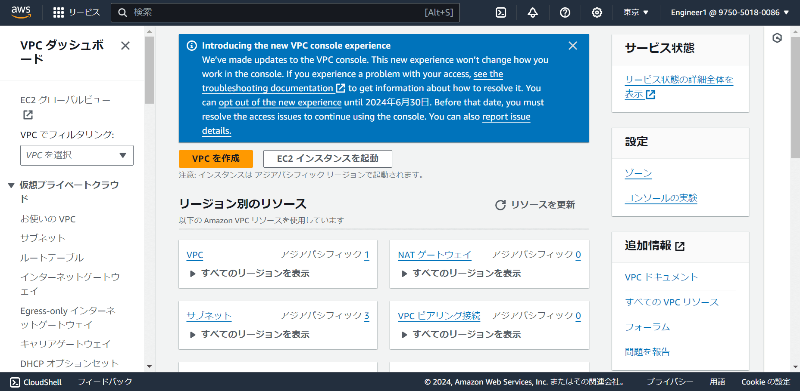
- 「VPCを作æˆã€ãƒœã‚¿ãƒ³ã‚’押下
- ç”»åƒã®é€šã‚Šã«VPCã®è¨­å®šã‚’ã™ã‚‹
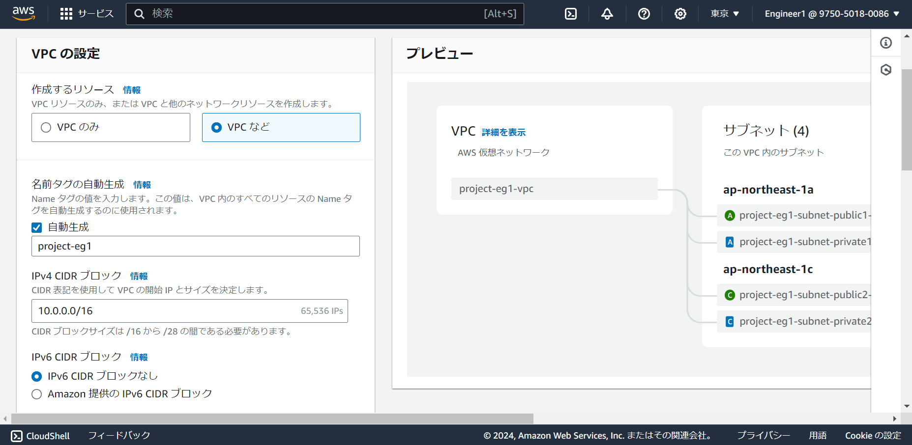
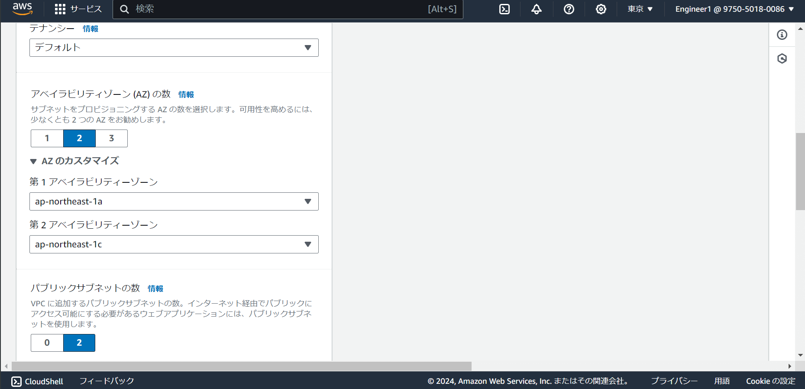
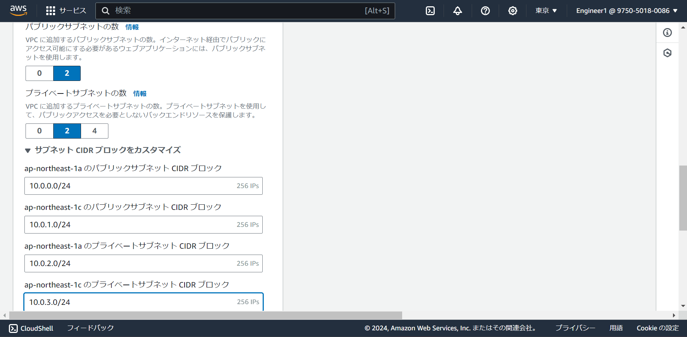
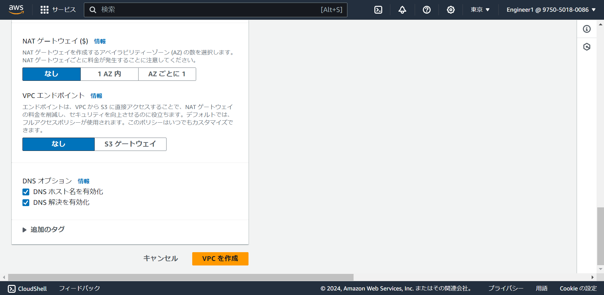

今å›ã®è¦ä»¶ã§ã¯AZx2, サブãƒãƒƒãƒˆ(public+private)x2を想定ã—ã¦ã„ã‚‹
|項目|設定値|
|---|---|
|作æˆã™ã‚‹ãƒªã‚½ãƒ¼ã‚¹|VPCãªã©|
|åå‰ã‚¿ã‚°ã®è‡ªå‹•ç”Ÿæˆ|自動生æˆ|
|IPv4 CIDR ブロック|10.0.0.0/16|
|IPv6 CIDR ブロック|ãªã—|
|アベイラビリティゾーン (AZ) ã®æ•°|2|
|第1アベイラビリティーゾーン|ap-northeast-1a|
|第2アベイラビリティーゾーン|ap-northeast-1c|
|パブリックサブãƒãƒƒãƒˆã®æ•°|2|
|プライベートサブãƒãƒƒãƒˆã®æ•°|2|
|ap-northeast-1a ã®ãƒ‘ブリックサブãƒãƒƒãƒˆ CIDR ブロック|10.0.0.0/24|
|ap-northeast-1c ã®ãƒ‘ブリックサブãƒãƒƒãƒˆ CIDR ブロック|10.0.1.0/24|
|ap-northeast-1a ã®ãƒ—ライベートサブãƒãƒƒãƒˆ CIDR ブロック|10.0.2.0/24|
|ap-northeast-1c ã®ãƒ—ライベートサブãƒãƒƒãƒˆ CIDR ブロック|10.0.3.0/24|
|NAT ゲートウェイ ($)|ãªã—|
|VPC エンドãƒã‚¤ãƒ³ãƒˆ|ãªã—|

- 最下部ã®ã€ŒVPCを作æˆã€ãƒœã‚¿ãƒ³ã‚’押下
- プログレス進行後ã€VPCãŒä½œæˆã•ã‚Œã‚‹
- (ä»»æ„)VPCã€ã‚µãƒ–ãƒãƒƒãƒˆã®åå‰å¤‰æ›´

## 2.AmazonEC2を作æˆã™ã‚‹
- EC2 コンソールã«ç§»å‹•ã—ã€ã€Œã‚¤ãƒ³ã‚¹ã‚¿ãƒ³ã‚¹ã‚’èµ·å‹•ã€ã‚’押下
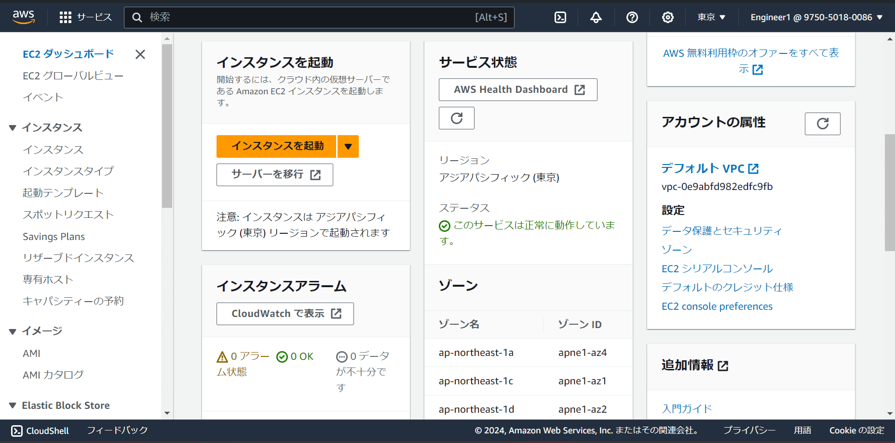

|項目|設定値|
|---|---|
|Amazon ãƒã‚·ãƒ³ã‚¤ãƒ¡ãƒ¼ã‚¸(AMI)|Amazon Linux2 AMI (HVM) Kernel 5.10, SSD Volume Type|
|インスタンスタイプ|t2.micro|
|キーペアå - å¿…é ˆ|キーペアãªã—ã§ç¶šè¡Œ(æ¨å¥¨ã•ã‚Œã¾ã›ã‚“)|

※キーペアå：SSHを設定ã™ã‚‹ã¨ãã«ä½¿ç”¨ã€‚今å›ã¯ä¸è¦

### ãƒãƒƒãƒˆãƒ¯ãƒ¼ã‚¯è¨­å®š
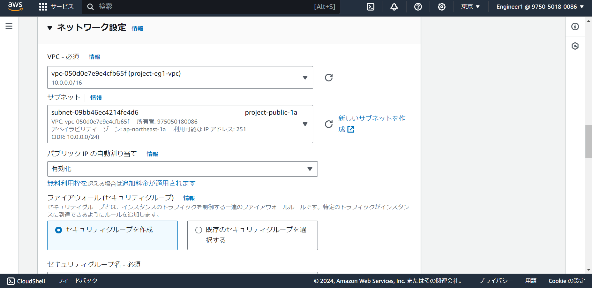
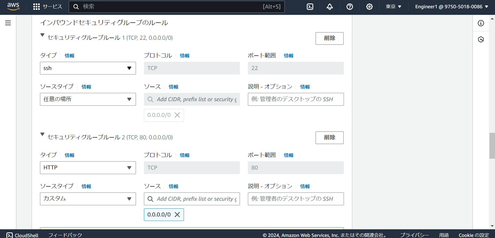
- 「編集ã€ãƒœã‚¿ãƒ³ã‚’押ã™
- VPC 㯠1.VPCを作æˆã™ã‚‹ ã§ä½œæˆã—ãŸã‚‚ã®ã‚’使用ã™ã‚‹
- パブリックサブãƒãƒƒãƒˆã¯ ap-northeast-1a ã®ã‚‚ã®ã‚’使ã†
- セキュリティグループåã‚’ã¤ã‘ã‚‹
- インãƒã‚¦ãƒ³ãƒ‰ã‚»ã‚­ãƒ¥ãƒªãƒ†ã‚£ã‚°ãƒ«ãƒ¼ãƒ—ã®ãƒ«ãƒ¼ãƒ«ã‚’追加ã™ã‚‹
  - HTTPを追加
  - ソース㫠0.0.0.0/0を追加

### ストレージを設定
今å›ã¯ã‚¹ã‚­ãƒƒãƒ—

### 高度ãªè©³ç´°
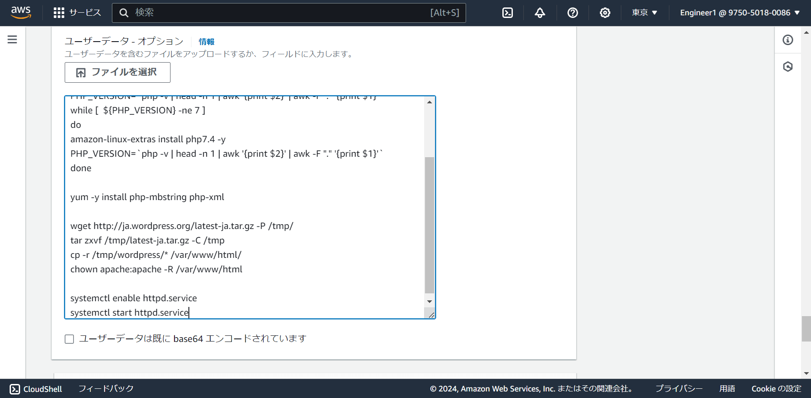

ユーザーデータ - オプション ã«ã‚³ãƒãƒ³ãƒ‰ã‚’貼り付ã‘ã‚‹
EC2インスタンス起動時ã«WordPressã®è‡ªå‹•ã‚¤ãƒ³ã‚¹ãƒˆãƒ¼ãƒ«ã¨èµ·å‹•ã‚’è¡Œã†ã‚³ãƒãƒ³ãƒ‰
https://pages.awscloud.com/rs/112-TZM-766/images/hfb_2022_wordpress_installation.txt

「インスタンスを起動ã€ã‚’押下ã—ã€ã‚¤ãƒ³ã‚¹ã‚¿ãƒ³ã‚¹ã®èµ·å‹•ã‚’確èª
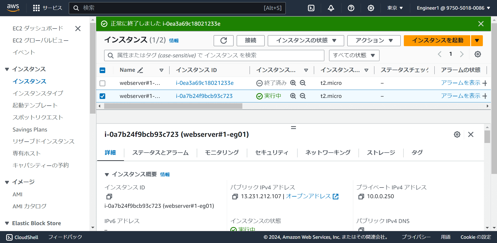

パブリックIPアドレスをコピーã—ã€å…ˆé ­ã«http://ã‚’ã¤ã‘ã‚‹ã¨ã€WordPressã®ç”»é¢ã«ã‚¢ã‚¯ã‚»ã‚¹ã§ãる。
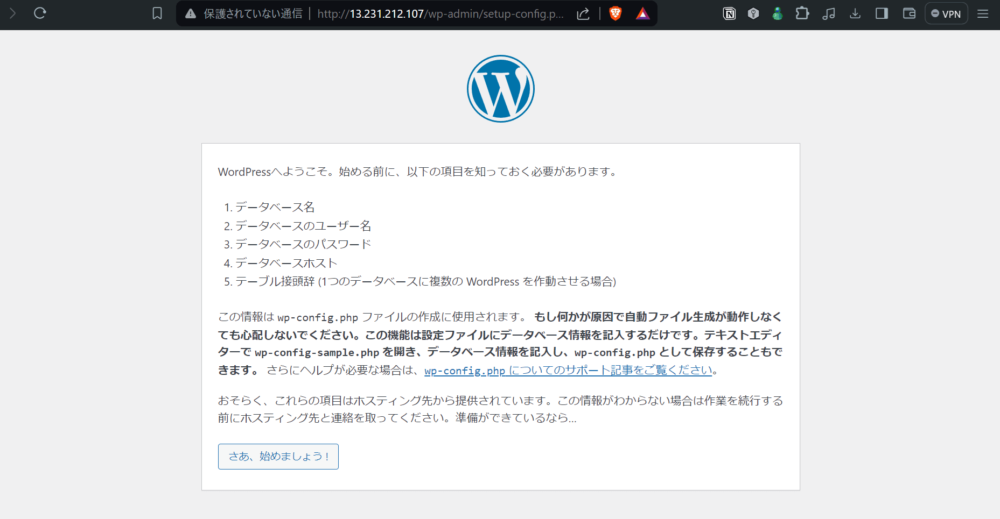

## RDS DBインスタンス用ã®ã‚»ã‚­ãƒ¥ãƒªãƒ†ã‚£ã‚°ãƒ«ãƒ¼ãƒ—を作æˆã™ã‚‹
EC2>セキュリティグループã«ã‚¢ã‚¯ã‚»ã‚¹ã—ã€ã€Œã‚»ã‚­ãƒ¥ãƒªãƒ†ã‚£ã‚°ãƒ«ãƒ¼ãƒ—を作æˆã™ã‚‹ã€ã‚’押下ã™ã‚‹ã€‚
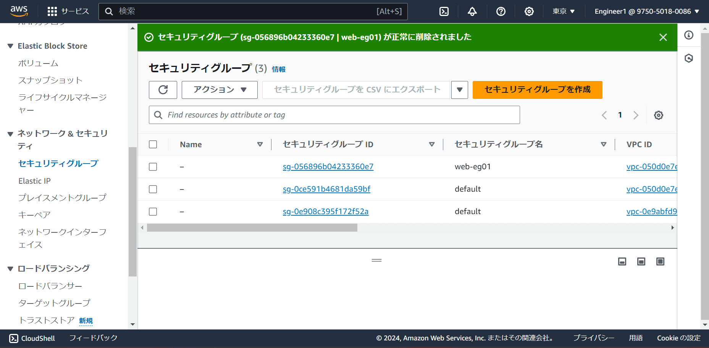
基本的ãªè©³ç´°
- セキュリティグループå・説æ˜ã¯ä»»æ„ã®å€¤
- VPCã¯å…ˆã»ã©ä½œæˆã—ãŸã‚‚ã®ã§è¨­å®š

### インãƒã‚¦ãƒ³ãƒ‰ãƒ«ãƒ¼ãƒ«

|タイプ|MySQL Aurora|
|プロトコル|TCP(自動)|
|ãƒãƒ¼ãƒˆç•ªå·|3306|
|ソース|EC2インスタンスã®ã‚»ã‚­ãƒ¥ãƒªãƒ†ã‚£ã‚°ãƒ«ãƒ¼ãƒ—|
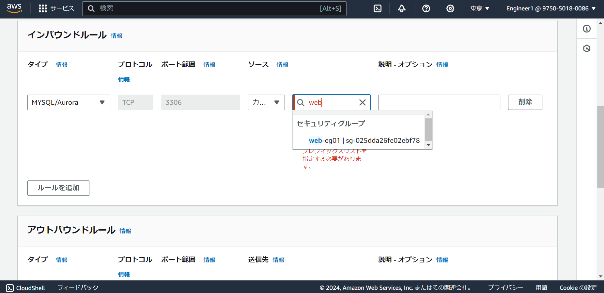
ä»–ã®é …ç›®ã¯ãƒ‡ãƒ•ã‚©ãƒ«ãƒˆ
セキュリティグループを作æˆ
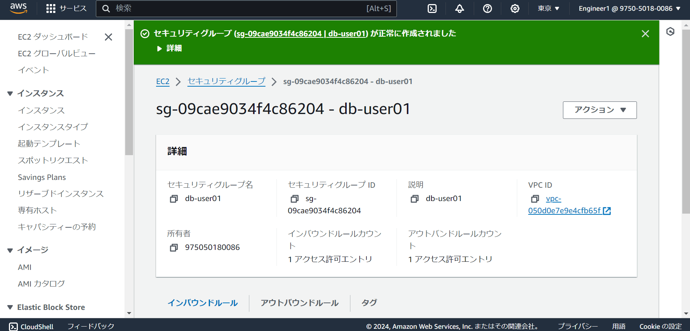


## 3.Amazon RDSを作æˆã™ã‚‹
RDS>サブãƒãƒƒãƒˆã‚°ãƒ«ãƒ¼ãƒ—ã¸ç§»å‹•ã—ã€ã€ŒDBサブãƒãƒƒãƒˆã‚°ãƒ«ãƒ¼ãƒ—を作æˆã€ã‚’押下
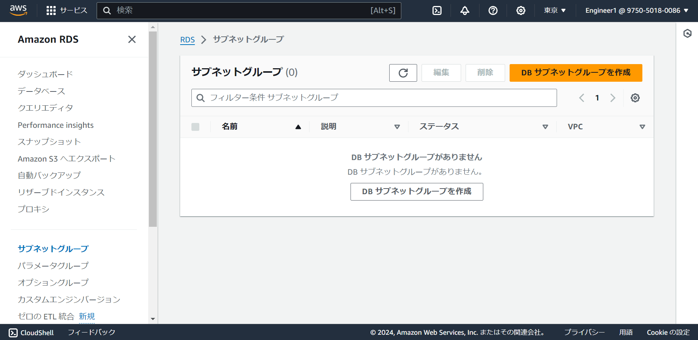
サブãƒãƒƒãƒˆã‚°ãƒ«ãƒ¼ãƒ—ã®è©³ç´°
- åå‰ãƒ»èª¬æ˜ã¯ä»»æ„ã®å€¤
- VPCã¯å…ˆã»ã©ä½œæˆã—ãŸã‚‚ã®ã§è¨­å®š

サブãƒãƒƒãƒˆã‚’追加
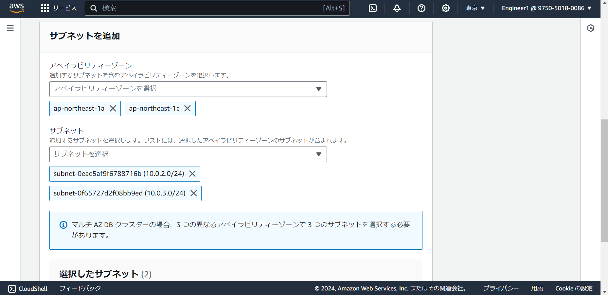

- AZã¯ap-northeast-1aã¨ap-northeast-1cを指定
- サブãƒãƒƒãƒˆã¯ãƒ—ライベートãªã®ã§10.0.2.0/24ã¨10.0.3.0/24を指定
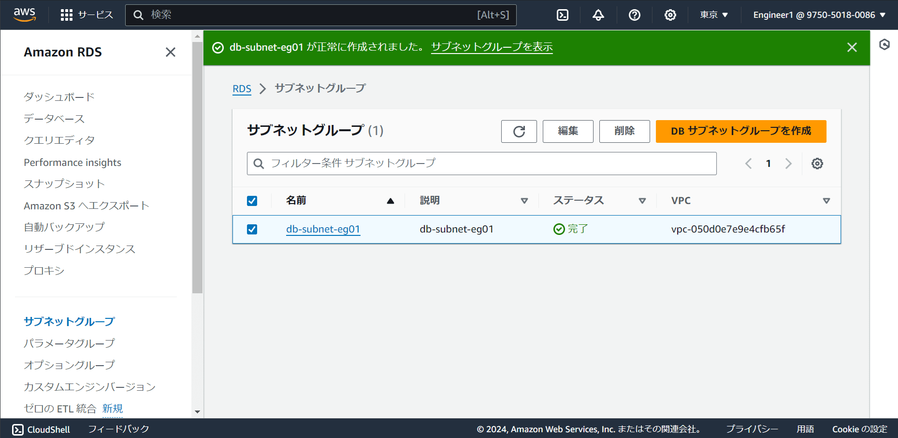

RDS>データベースã¸ç§»å‹•ã—ã€ã€Œãƒ‡ãƒ¼ã‚¿ãƒ™ãƒ¼ã‚¹ã®ä½œæˆã€ã‚’押下


DBエンジンã¯MySQLã‚’é¸æŠ
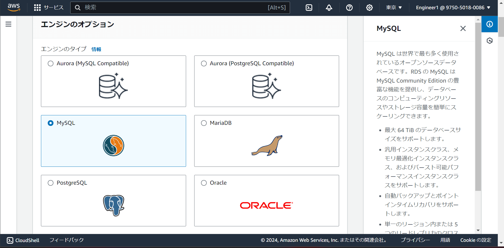

テンプレートã¯ç„¡æ–™åˆ©ç”¨æ ã‚’é¸æŠ


èªè¨¼æƒ…報管ç†ã‚’「セルフãƒãƒãƒ¼ã‚¸ãƒ‰ã€ã«è¨­å®šã—ã¦ãƒ‘スワードを設定
※本番環境ã§ã¯SecretManagerã®ä½¿ç”¨ã‚’æ¨å¥¨
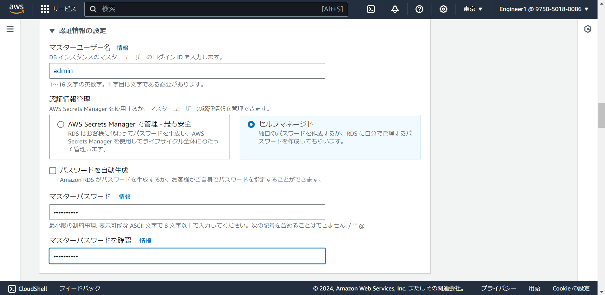

インスタンスã®è¨­å®šãƒ»ã‚¹ãƒˆãƒ¬ãƒ¼ã‚¸ã¯ãƒ‡ãƒ•ã‚©ãƒ«ãƒˆã®ã¾ã¾
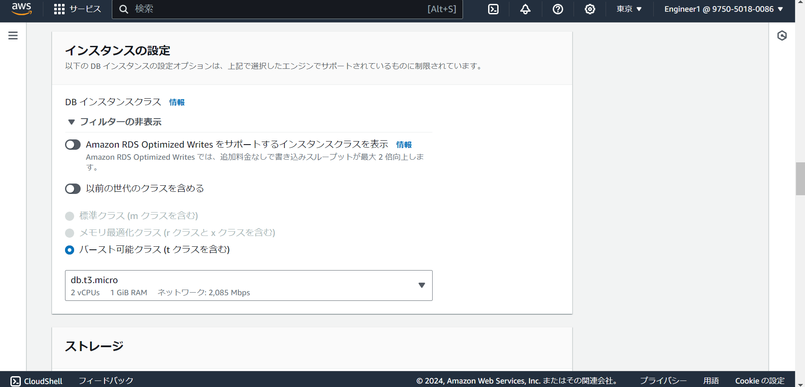
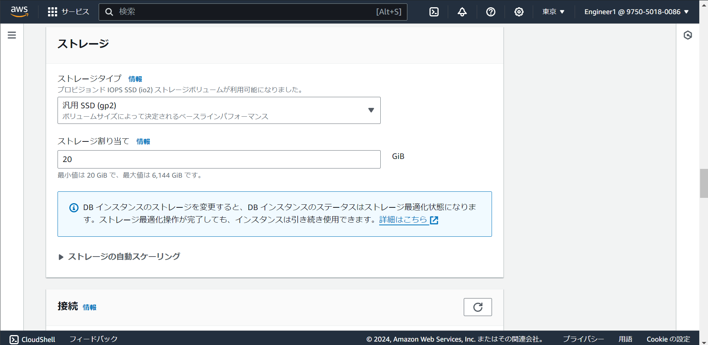

「EC2コンピューティングリソースã«æ¥ç¶šã—ãªã„ã€ã‚’é¸æŠã™ã‚‹ã€‚
VPCã¨VPCセキュリティグループã€DBサブãƒãƒƒãƒˆã‚°ãƒ«ãƒ¼ãƒ—を作æˆã—ãŸã‚‚ã®ã«è¨­å®šã™ã‚‹
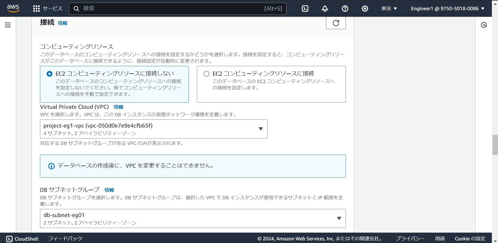
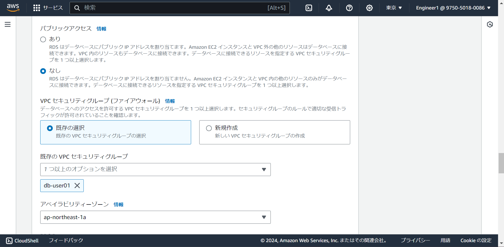

追加設定ã§DBã®åå‰ã‚’設定ã™ã‚‹ã€‚
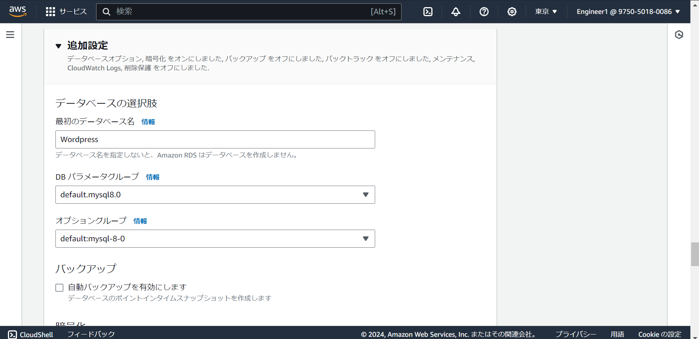

データベースを作æˆã—ã€æ™‚間経é後ã«å®Ÿè¡Œä¸­ã¨ãªã‚‹ã“ã¨ã‚’確èª
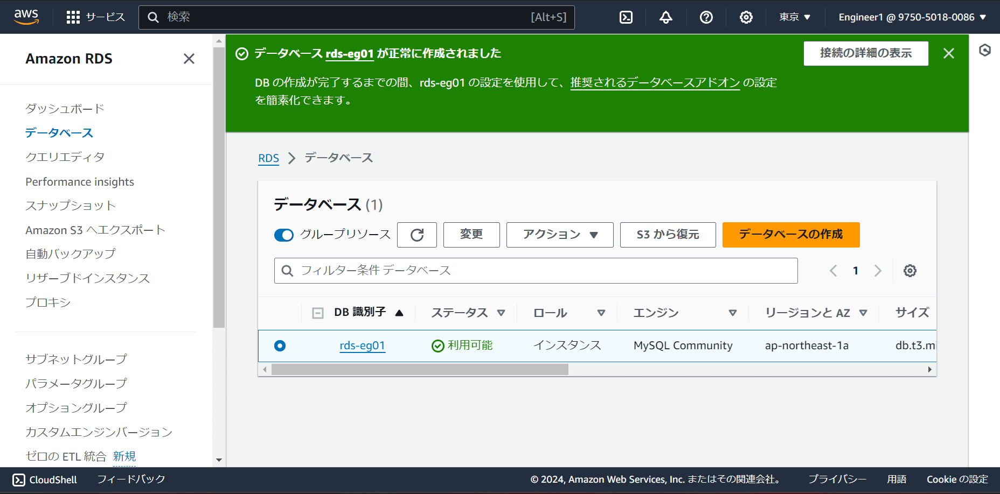

RDSã‚’é¸æŠã—ã€RDSエンドãƒã‚¤ãƒ³ãƒˆã‚’コピーã—メモã«å–ã‚‹
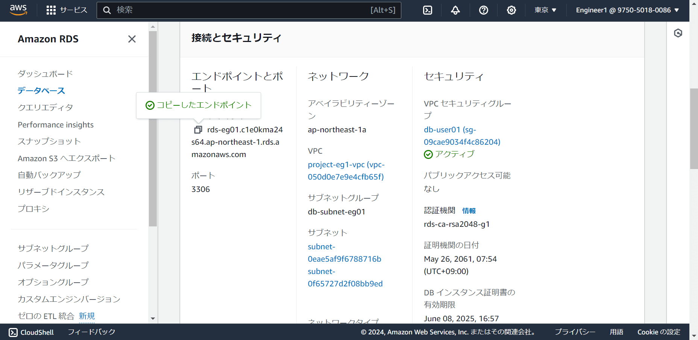

## 4.è² è·åˆ†æ•£ç”¨ã®ELBを作æˆã™ã‚‹
ELBã®ã‚»ã‚­ãƒ¥ãƒªãƒ†ã‚£ã‚°ãƒ«ãƒ¼ãƒ—を作æˆã™ã‚‹ã€‚
EC2>セキュリティグループã«ç§»å‹•ã—ã€ã€Œã‚»ã‚­ãƒ¥ãƒªãƒ†ã‚£ã‚°ãƒ«ãƒ¼ãƒ—を作æˆã™ã‚‹ã€ã‚’押下ã™ã‚‹
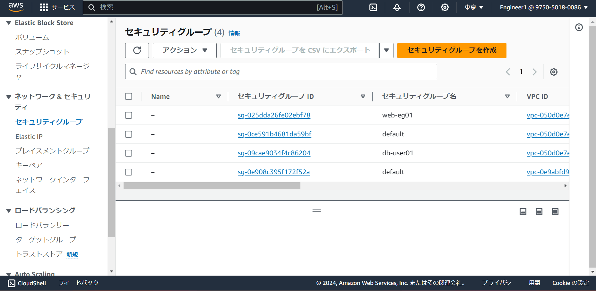

基本的ãªè©³ç´°
- セキュリティグループå・説æ˜ã¯ä»»æ„ã®å€¤
- VPCã¯å…ˆã»ã©ä½œæˆã—ãŸã‚‚ã®ã§è¨­å®š

インãƒã‚¦ãƒ³ãƒ‰ãƒ«ãƒ¼ãƒ«
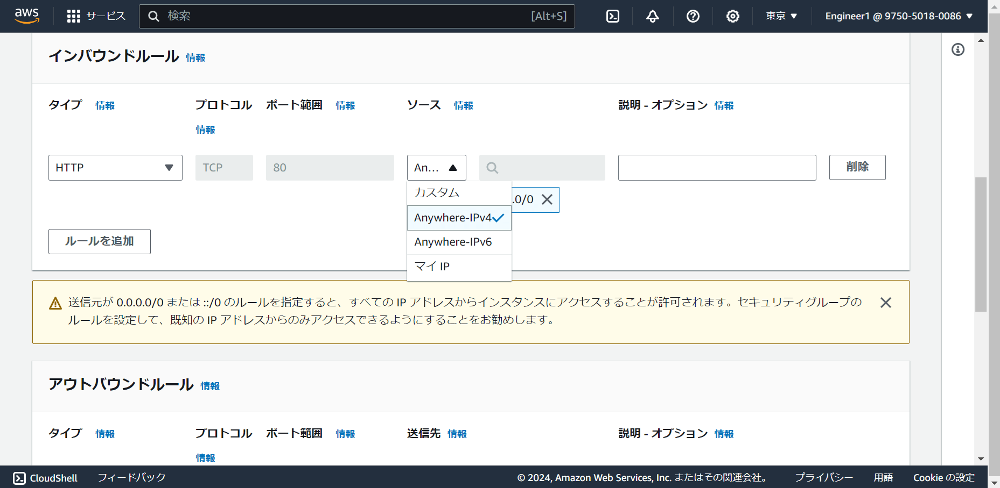
- HTTPã‚’é¸æŠã—ã€ã‚½ãƒ¼ã‚¹ã«AnyWhereIPv4ã‚’é¸æŠã™ã‚‹ã€‚0.0.0.0/0を設定ã™ã‚‹
- アウトãƒã‚¦ãƒ³ãƒ‰ãƒ«ãƒ¼ãƒ«ã¯ãƒ‡ãƒ•ã‚©ãƒ«ãƒˆã®ã¾ã¾

セキュリティグループを作æˆå®Œäº†
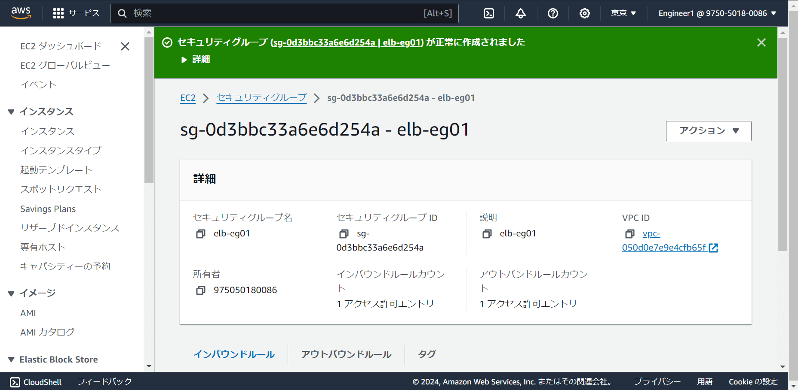

EC2>ターゲットグループã«ç§»å‹•ã™ã‚‹ã€‚「ターゲットグループã®ä½œæˆã€ã‚’押下ã™ã‚‹
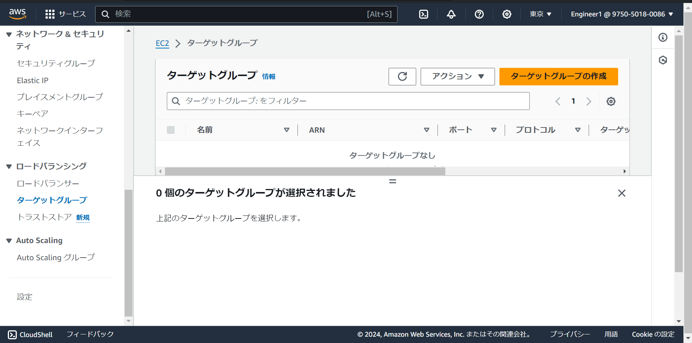

ターゲットグループåã¨VPCを設定ã™ã‚‹
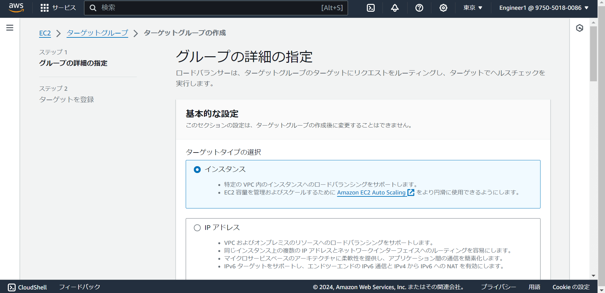
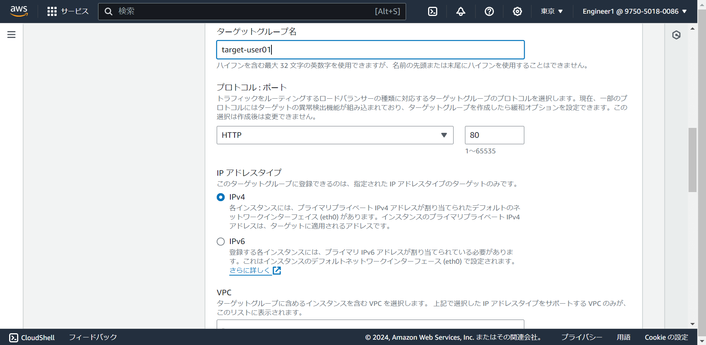
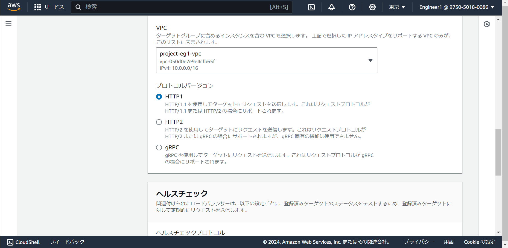

ヘルスãƒã‚§ãƒƒã‚¯ãƒ‘スã¯ä»¥ä¸‹ã®ãƒªãƒ³ã‚¯å†…ã®ãƒ‘スを記入。(空白ã«æ³¨æ„)
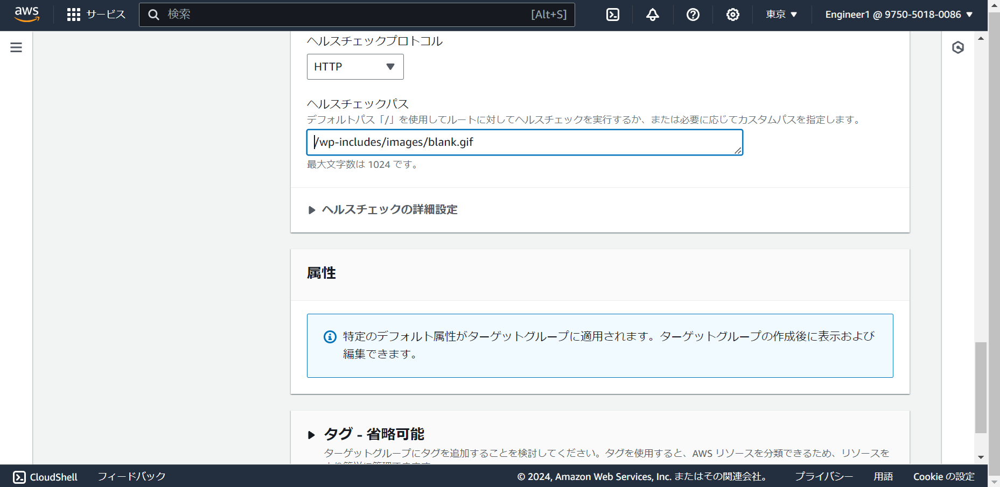
https://pages.awscloud.com/rs/112-TZM-766/images/healthcheck_path.txt

使用å¯èƒ½ãªã‚¤ãƒ³ã‚¹ã‚¿ãƒ³ã‚¹ã«ãƒã‚§ãƒƒã‚¯ã‚’入れる。「ä¿ç•™ä¸­ã¨ã—ã¦ä»¥ä¸‹ã‚’å«ã‚ã‚‹ã€ã‚’押下ã™ã‚‹ã€‚
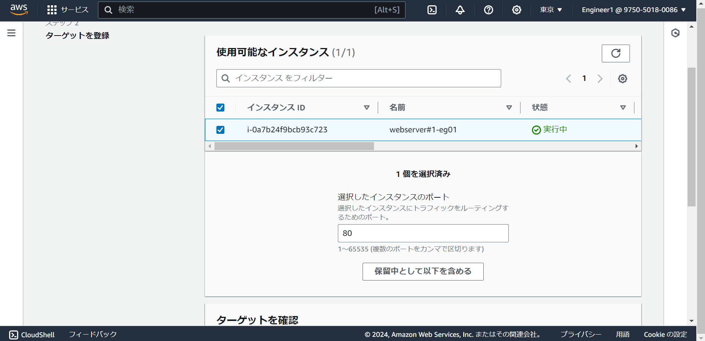

ターゲットを確èªã®æ¬„ã«ä¿ç•™ä¸­ã®ã‚¤ãƒ³ã‚¹ã‚¿ãƒ³ã‚¹ãŒå«ã¾ã‚Œã¦ã„ã‚‹ã“ã¨ã‚’確èªã—ã€ã‚¿ãƒ¼ã‚²ãƒƒãƒˆã‚°ãƒ«ãƒ¼ãƒ—を作æˆ
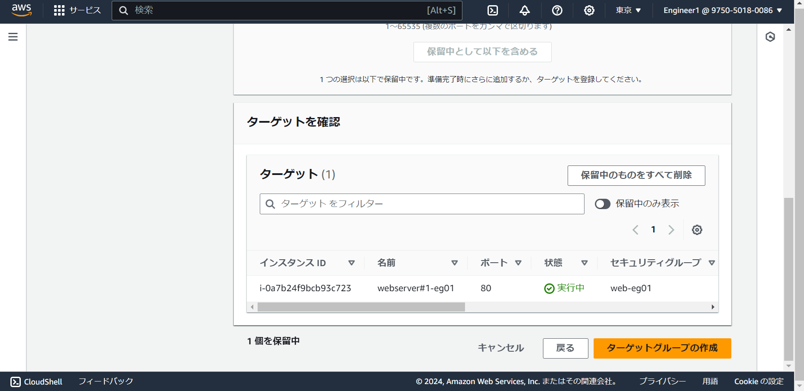

EC2>ロードãƒãƒ©ãƒ³ã‚µãƒ¼ã«ç§»å‹•ã—ã€ã€Œãƒ­ãƒ¼ãƒ‰ãƒãƒ©ãƒ³ã‚µãƒ¼ã‚’作æˆã€ã‚’押下
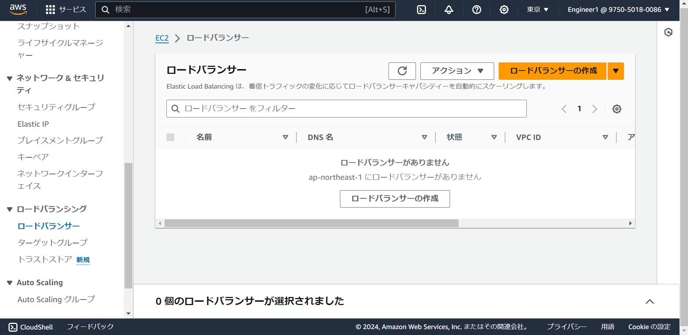

ALB(Application Load Balancer)ã‚’é¸æŠã—ã€ä½œæˆ
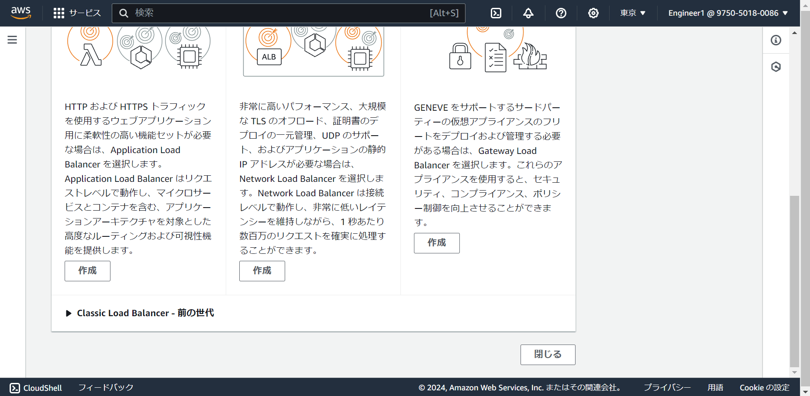

VPCã¨ãƒ‘ブリックサブãƒãƒƒãƒˆã‚’設定ã™ã‚‹
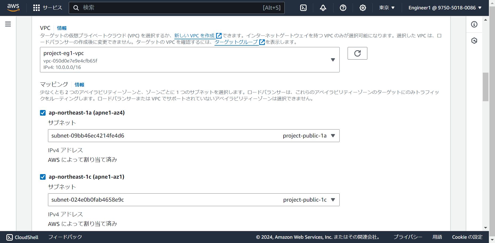

リスナーã«HTTPã‚’é¸æŠã—ã€ä½œæˆã—ãŸã‚¿ãƒ¼ã‚²ãƒƒãƒˆã‚°ãƒ«ãƒ¼ãƒ—を転é€å…ˆã«ã‚¢ã‚¿ãƒƒãƒã™ã‚‹
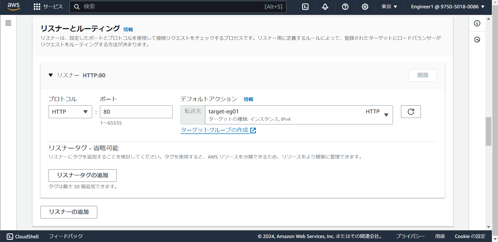

WAFã‚„Global Acceleratorã¯ã“ã“ã§é©ç”¨ã§ãã‚‹(今å›ã¯ãƒ‘ス)
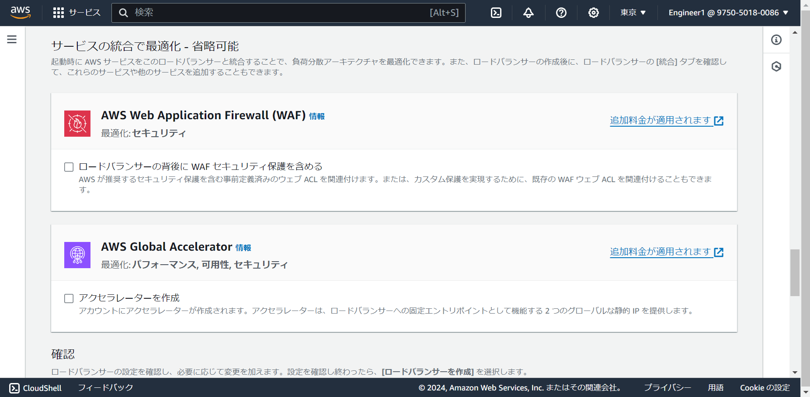

ロードãƒãƒ©ãƒ³ã‚µãƒ¼ãŒä½œæˆã•ã‚Œã€çŠ¶æ…‹ãŒã‚¢ã‚¯ãƒ†ã‚£ãƒ–ã«ãªã£ã¦ã„ã‚‹ã“ã¨ã‚’確èªã™ã‚‹
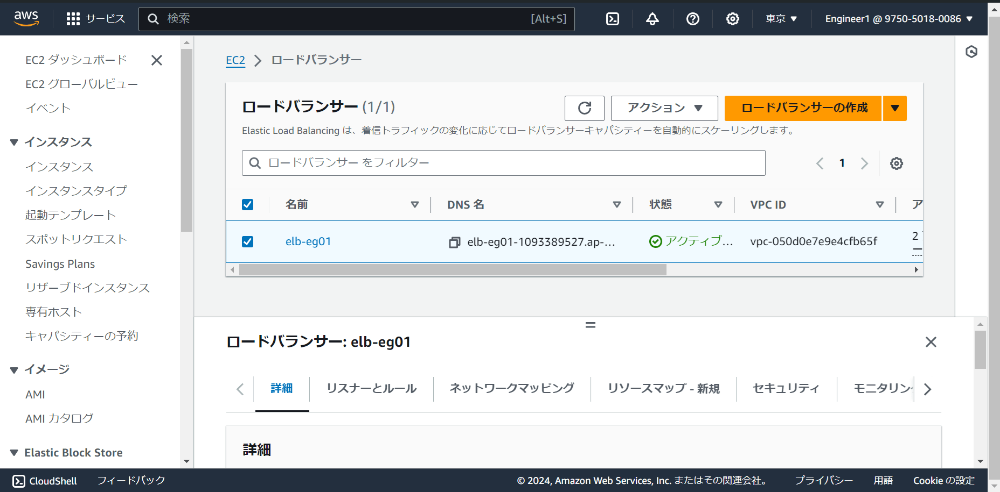

ELBã‚’é¸æŠã™ã‚‹ã€‚DNSåをコピーã—ã€ãƒ¡ãƒ¢ã«å–ã‚‹
(WordPressã®ãƒ›ã‚¹ãƒˆåã«ä½¿ç”¨ã™ã‚‹)


## 5.WordPressã‚’åˆæœŸè¨­å®šã™ã‚‹
コピーã—ãŸDNSåã®å…ˆé ­ã«"http://"を付加ã—ã¦æ¤œç´¢ã™ã‚‹ã¨ã€WordPressã®è¨­å®šãƒšãƒ¼ã‚¸ã«é£›ã¶
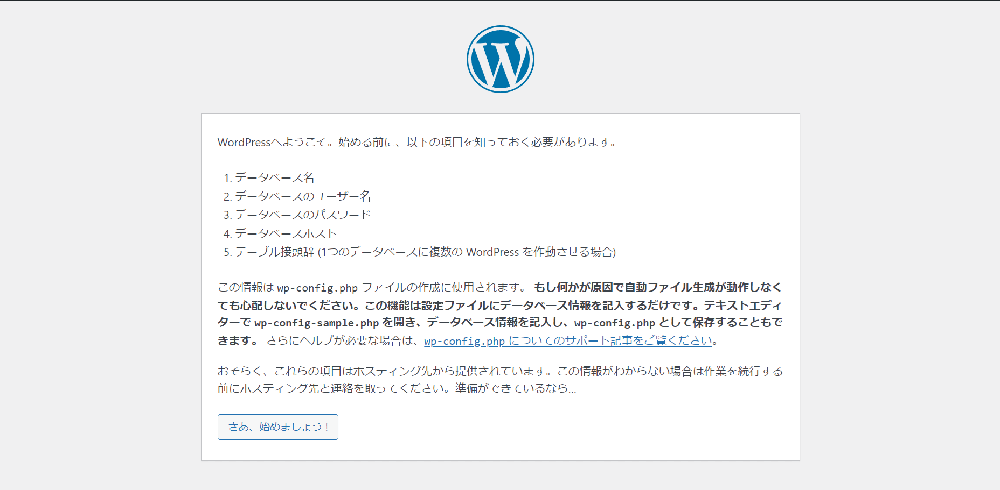

RDS>データベースã‹ã‚‰ã€DB識別å­ã‚’クリックã™ã‚‹
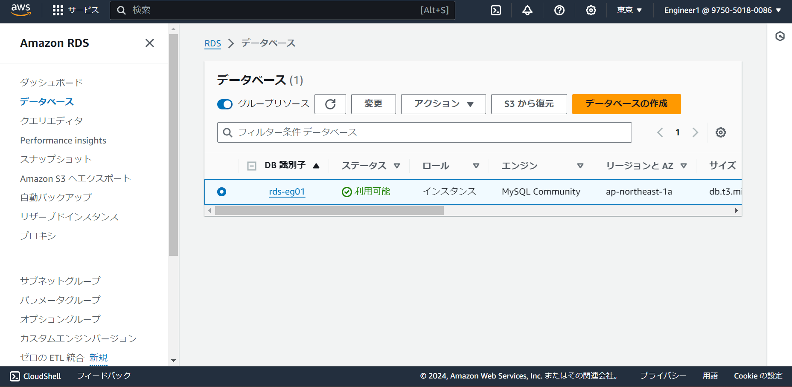

æ¥ç¶šã¨ã‚»ã‚­ãƒ¥ãƒªãƒ†ã‚£ã‹ã‚‰ã€RDSã®ã‚¨ãƒ³ãƒ‰ãƒã‚¤ãƒ³ãƒˆã‚’コピーã™ã‚‹
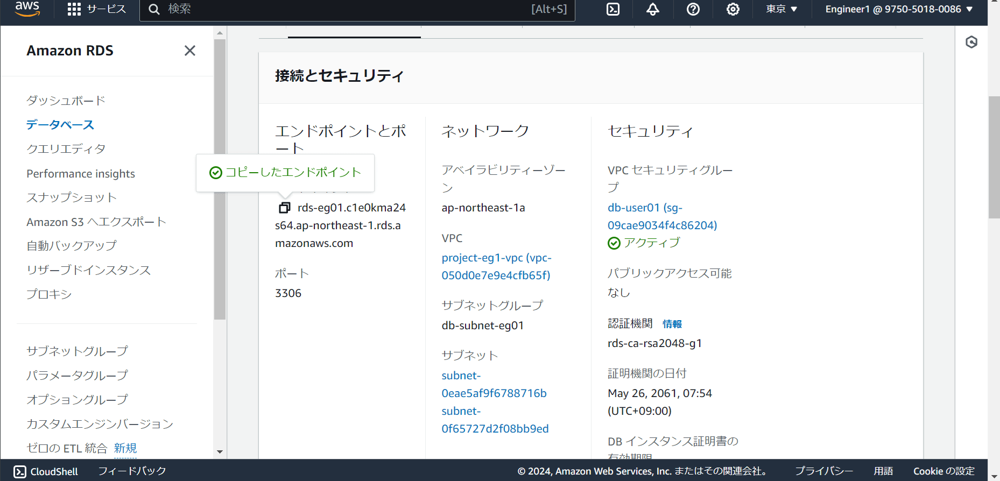

WordPress設定画é¢ã§ã‚³ãƒ”ーã—ãŸã‚¨ãƒ³ãƒ‰ãƒã‚¤ãƒ³ãƒˆã‚’データベースã®ãƒ›ã‚¹ãƒˆåã«è²¼ã‚Šä»˜ã‘ã‚‹
é€ä¿¡ãƒœã‚¿ãƒ³ã‚’押ã™
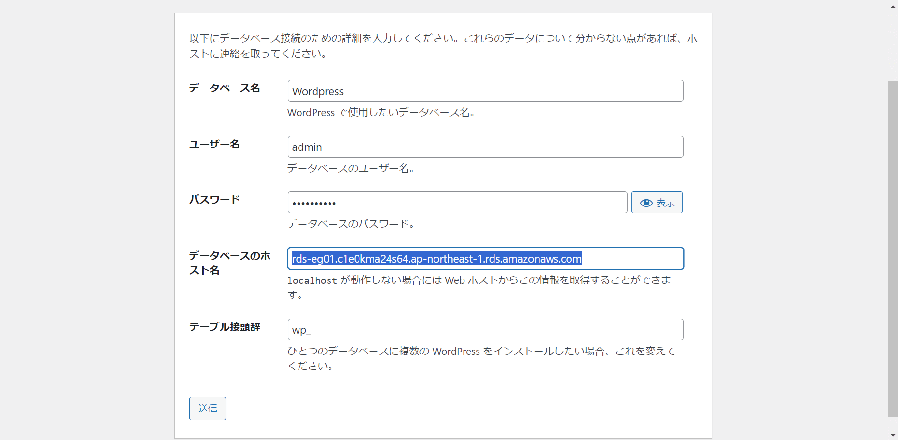

「インストール実行ã€ãƒœã‚¿ãƒ³ã‚’押ã™
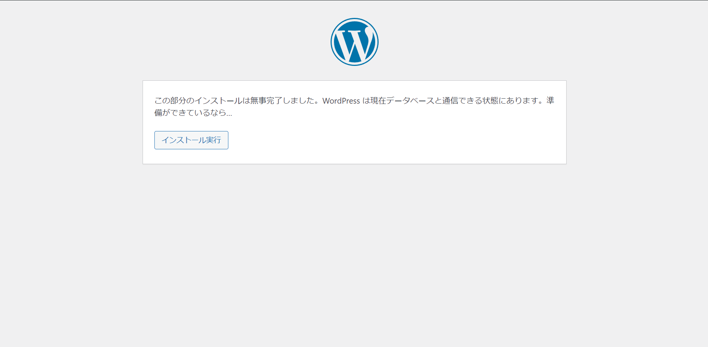

å¿…è¦äº‹é …を記入ã™ã‚‹ã€‚ã‚ã¨ã§ç®¡ç†ç”»é¢ã§ã‚«ã‚¹ã‚¿ãƒã‚¤ã‚ºã™ã‚‹å ´åˆã¯ãƒ‘スワードをコピーã™ã‚‹
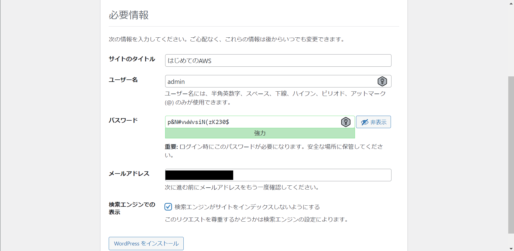

インストールã«æˆåŠŸã™ã‚‹ã®ã§ã€ãƒ­ã‚°ã‚¤ãƒ³ãƒœã‚¿ãƒ³ã‚’押ã™
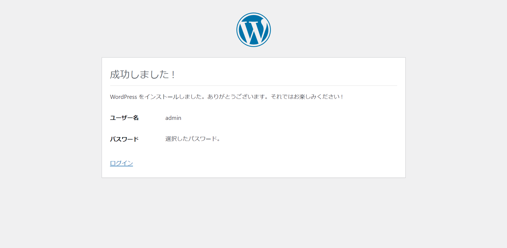

サイトã®ã‚¿ã‚¤ãƒˆãƒ«(ã¯ã˜ã‚ã¦ã®AWS)をクリックã™ã‚‹
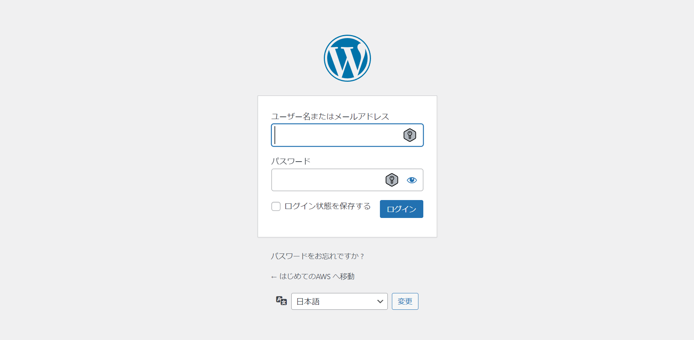

サイトã¸ã®ã‚¢ã‚¯ã‚»ã‚¹ãŒç¢ºèªã§ãã‚‹
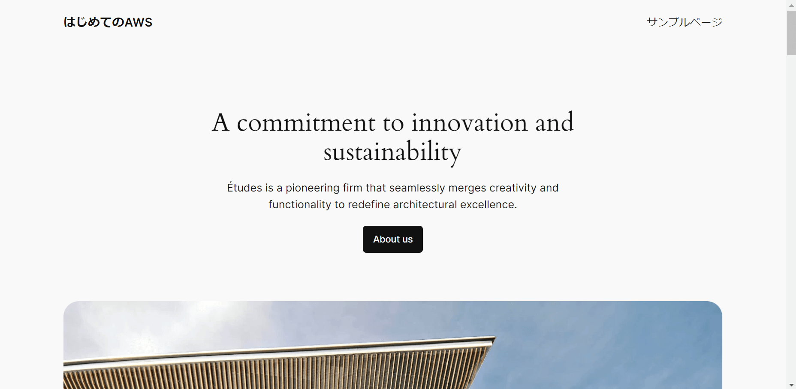

## 6.AMIã®ä½œæˆã¨ä½œæˆã—ãŸAMIã‹ã‚‰2ã¤ã‚ã®EC2インスタンス起動

### AMIを作æˆã™ã‚‹
EC2>インスタンスã§ã‚¤ãƒ³ã‚¹ã‚¿ãƒ³ã‚¹ã‚’é¸æŠã™ã‚‹
アクション>イメージã¨ãƒ†ãƒ³ãƒ—レート>イメージを作æˆã‚’クリック
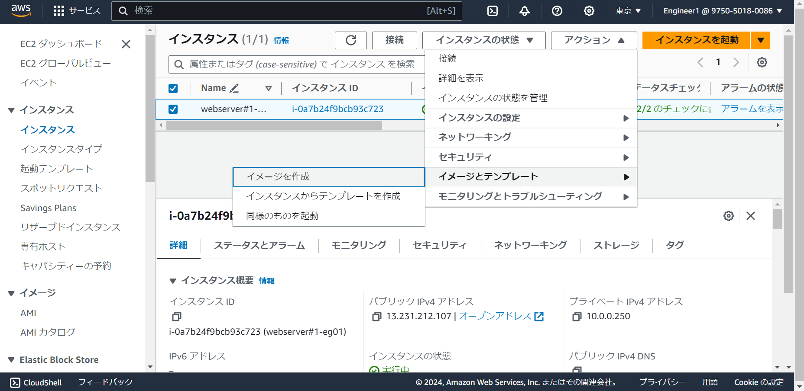

イメージåを設定ã—ã€ã€Œã‚¤ãƒ¡ãƒ¼ã‚¸ã‚’作æˆã™ã‚‹ã€ãƒœã‚¿ãƒ³ã‚’押下ã™ã‚‹
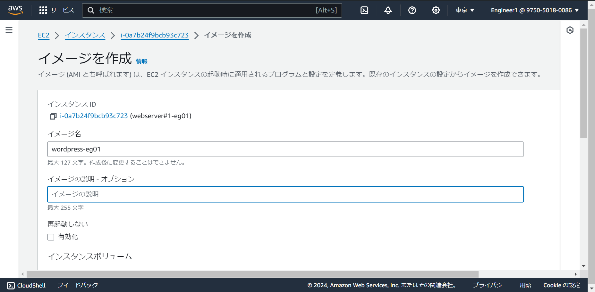

AMIãŒä½œæˆã•ã‚Œã‚‹ã€‚é¸æŠå¾Œã€ã€ŒAMIã‹ã‚‰ã‚¤ãƒ³ã‚¹ã‚¿ãƒ³ã‚¹ã‚’èµ·å‹•ã€ãƒœã‚¿ãƒ³ã‚’押ã™
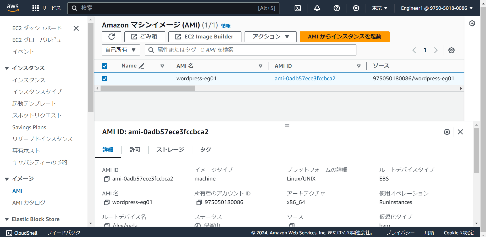

### 2ã¤ç›®ã®ã‚¤ãƒ³ã‚¹ã‚¿ãƒ³ã‚¹ã‚’èµ·å‹•ã™ã‚‹
åå‰ã‚’設定ã™ã‚‹ã€‚アプリケーションãŠã‚ˆã³OSイメージã€ã‚¤ãƒ³ã‚¹ã‚¿ãƒ³ã‚¹ã‚¿ã‚¤ãƒ—ã€ã‚­ãƒ¼ãƒšã‚¢ã¯ä¸€ã¤ç›®ã®ã‚¤ãƒ³ã‚¹ã‚¿ãƒ³ã‚¹ã¨è¨­å®šã¯åŒã˜
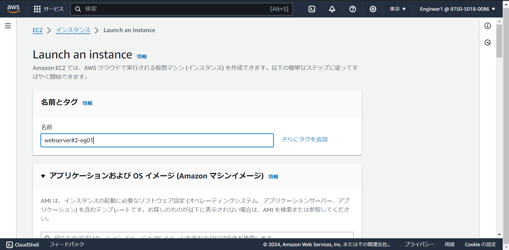
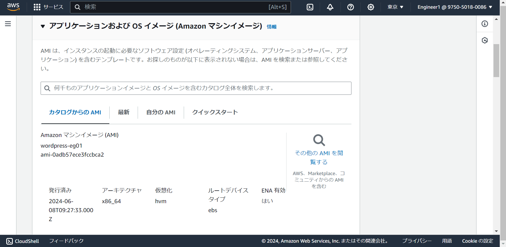
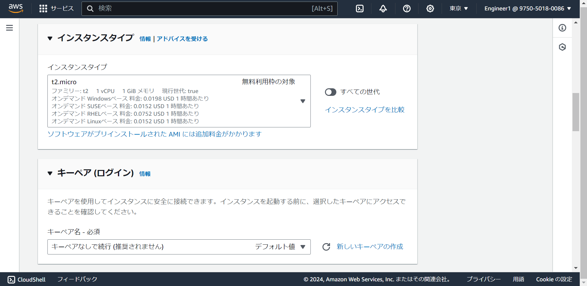

ãƒãƒƒãƒˆãƒ¯ãƒ¼ã‚¯è¨­å®šã‚’編集ã™ã‚‹
VPC,パブリックサブãƒãƒƒãƒˆ(AZã¯ap-northeast-1cã®ã‚‚ã®)ã€ãƒ‘ブリックIP自動割り当ã¦ã‚’設定ã™ã‚‹
セキュリティグループã¯æ—¢å­˜ã®ã‚¤ãƒ³ã‚¹ã‚¿ãƒ³ã‚¹ã®ã‚‚ã®ã‚’使用ã™ã‚‹
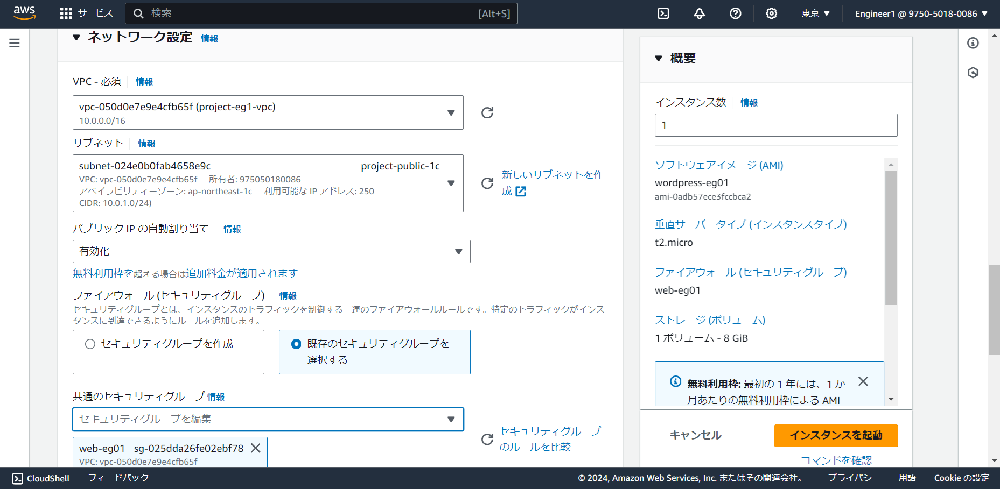

高度ãªè©³ç´°>ユーザーデータã«ã¤ã„ã¦ã¯ã€AMI作æˆæ™‚ã«ã‚½ãƒ¼ã‚¹ãƒ•ã‚¡ã‚¤ãƒ«ãŒå«ã¾ã‚Œã¦ã„ã‚‹ãŸã‚記入ã®å¿…è¦ã¯ãªã„
インスタンスを起動ã™ã‚‹
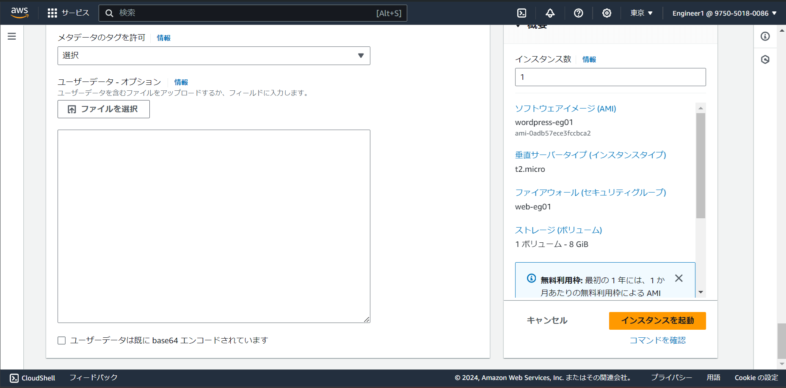

2ã¤ç›®ã®ã‚¤ãƒ³ã‚¹ã‚¿ãƒ³ã‚¹ãŒèµ·å‹•ã—ãŸã“ã¨ã‚’確èªã™ã‚‹
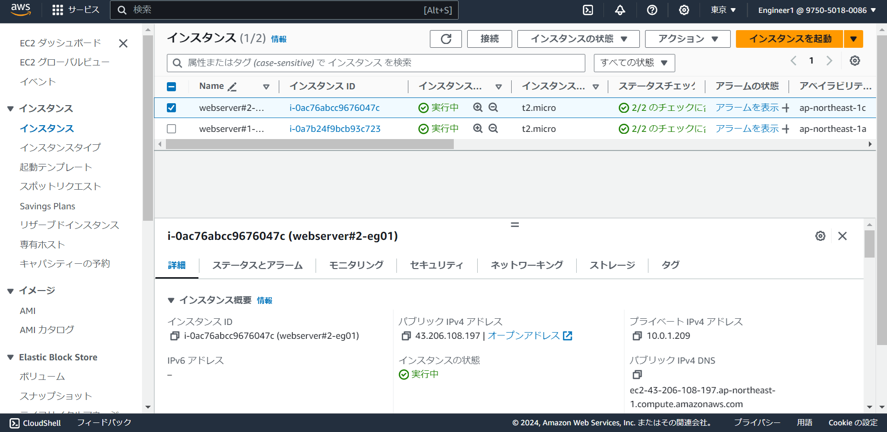

### 2ã¤ç›®ã®ã‚¤ãƒ³ã‚¹ã‚¿ãƒ³ã‚¹ã‚’ELBã«ç´ã¥ã‘ã‚‹
EC2>ターゲットグループより作æˆæ¸ˆã¿ã®ã‚¿ãƒ¼ã‚²ãƒƒãƒˆã‚°ãƒ«ãƒ¼ãƒ—ã®åå‰ã‚’クリックã™ã‚‹
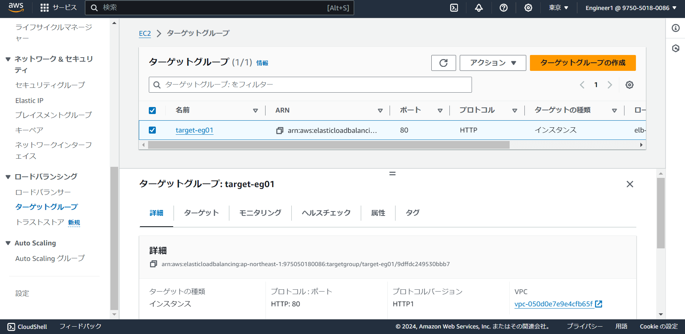

登録済ã¿ã‚¿ãƒ¼ã‚²ãƒƒãƒˆã®ã€Œã‚¿ãƒ¼ã‚²ãƒƒãƒˆã‚’登録ã€ãƒœã‚¿ãƒ³ã‚’押ã™
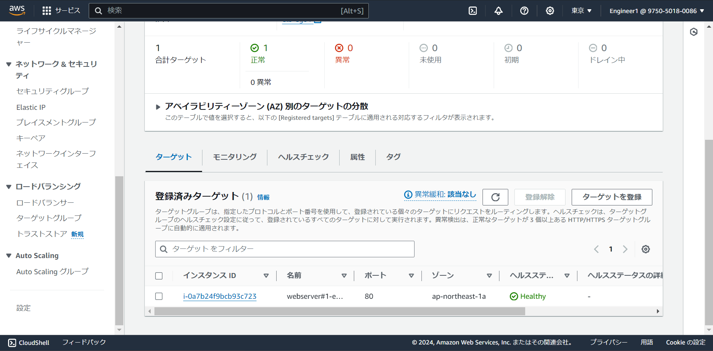

2ã¤ç›®ã®ã‚¤ãƒ³ã‚¹ã‚¿ãƒ³ã‚¹ã‚’é¸æŠã—ã€ã€Œä¿ç•™ä¸­ã¨ã—ã¦ä»¥ä¸‹ã‚’å«ã‚ã‚‹ã€ãƒœã‚¿ãƒ³ã‚’押ã™
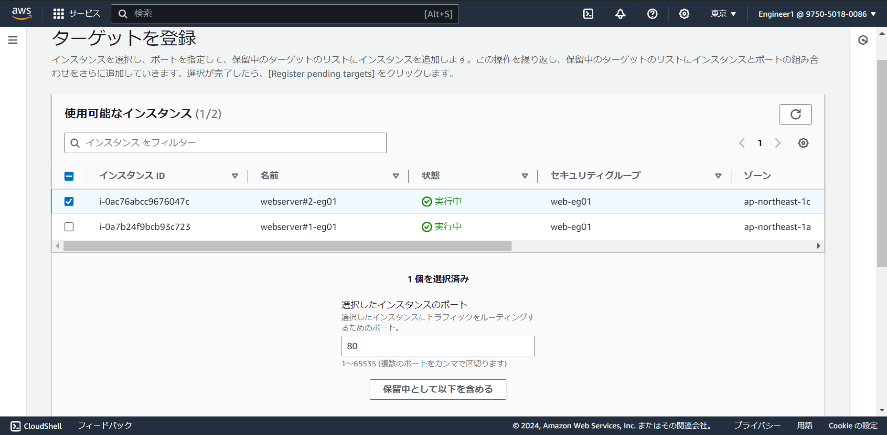

2ã¤ç›®ã®ã‚¤ãƒ³ã‚¹ã‚¿ãƒ³ã‚¹ãŒä¿ç•™ä¸­ã«ãªã£ã¦ã„ã‚‹ã“ã¨ã‚’確èªã—ã€ã€Œä¿ç•™ä¸­ã®ã‚¿ãƒ¼ã‚²ãƒƒãƒˆã‚’登録ã€ãƒœã‚¿ãƒ³ã‚’押ã™
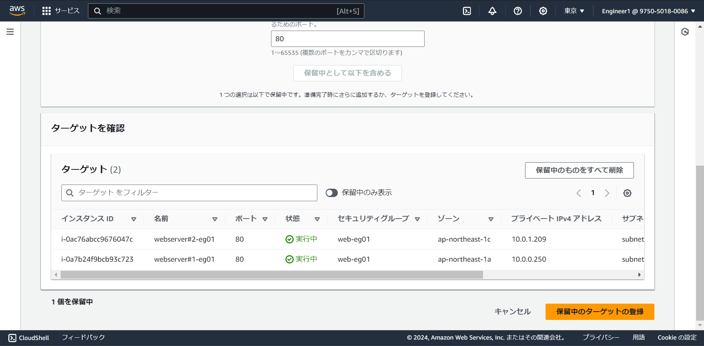

登録済ã¿ã‚¿ãƒ¼ã‚²ãƒƒãƒˆã«2ã¤ç›®ã®ã‚¤ãƒ³ã‚¹ã‚¿ãƒ³ã‚¹ãŒç™»éŒ²ã•ã‚Œã¦ã„ã‚‹
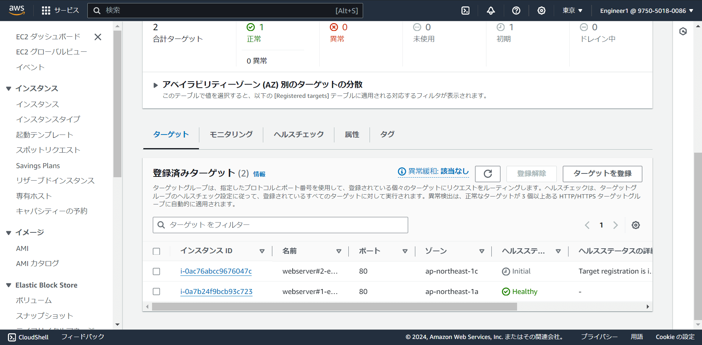

2ã¤ç›®ã®ã‚¤ãƒ³ã‚¹ã‚¿ãƒ³ã‚¹ã¨ELBãŒé€£æºã•ã‚Œã‚‹

## 7.作æˆæ¸ˆã¿ã®RDS DBインスタンスをãƒãƒ«ãƒAZ化ã™ã‚‹
RDS>データベースよりã€ãƒ‡ãƒ¼ã‚¿ãƒ™ãƒ¼ã‚¹ã«ãƒã‚§ãƒƒã‚¯ã‚’入れる。変更ボタンを押ã™
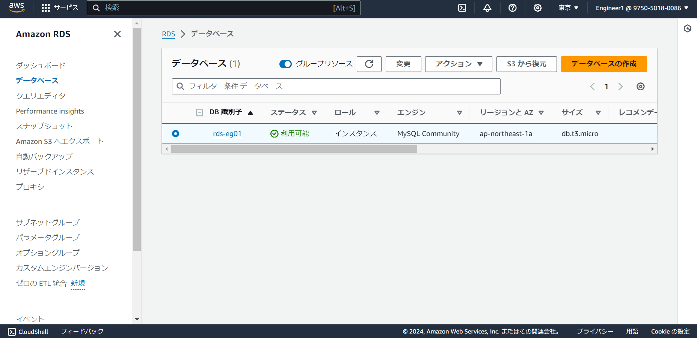

å¯ç”¨æ€§ã¨è€ä¹…性ã®æ¬„ã§ã€ã€Œã‚¹ã‚¿ãƒ³ãƒã‚¤ã‚¤ãƒ³ã‚¹ã‚¿ãƒ³ã‚¹ã‚’作æˆã™ã‚‹ã€ã«ãƒã‚§ãƒƒã‚¯ã‚’入れる
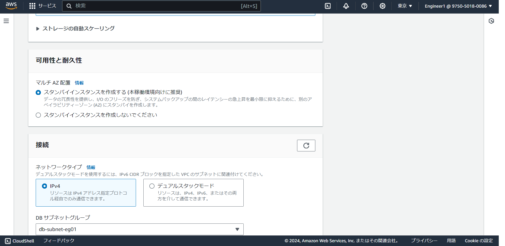

ページ最下部ã®ã€Œç¶šè¡Œã€ãƒœã‚¿ãƒ³ã‚’押ã™
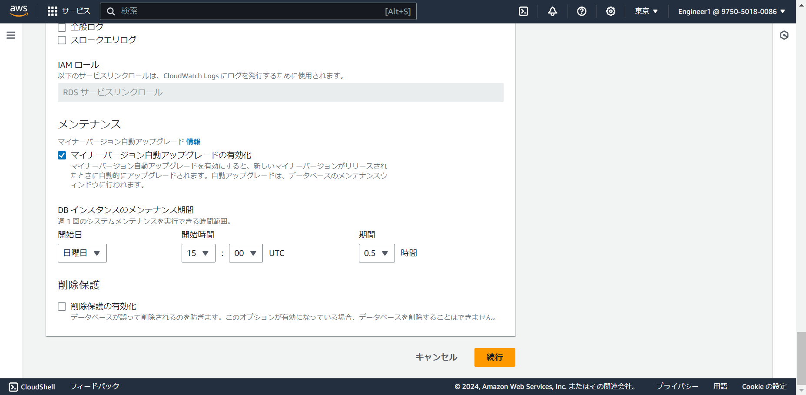

変更ã®ã‚¹ã‚±ã‚¸ãƒ¥ãƒ¼ãƒ«ã®ã€Œã™ãã«é©ç”¨ã€ã«ãƒã‚§ãƒƒã‚¯ã‚’入れる。「DBインスタンスを変更ã€ãƒœã‚¿ãƒ³ã‚’押ã™
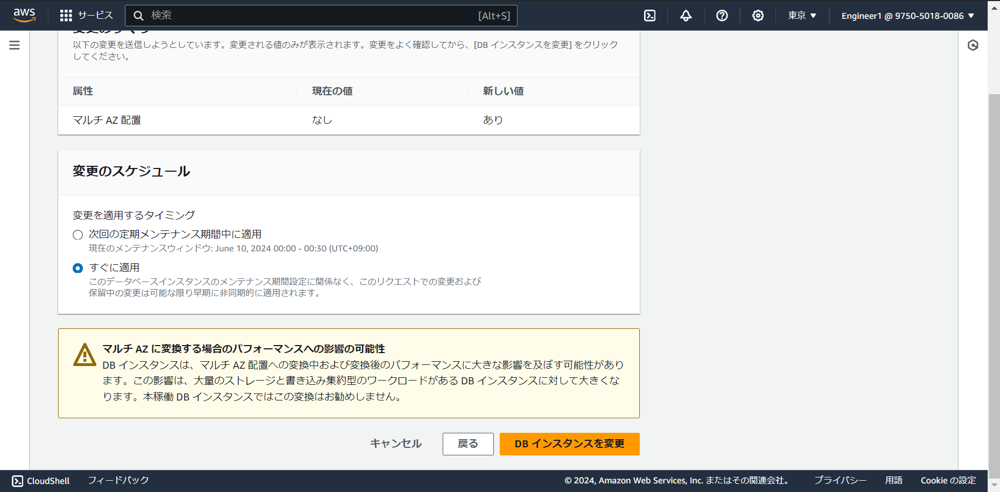

DB設定ã®å¤‰æ›´ãŒå§‹ã¾ã‚‹
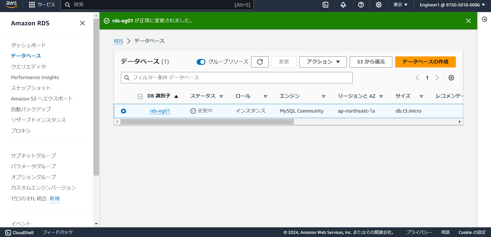

時間経é後ã«ã€ãƒãƒ«ãƒAZãŒã‚ã‚Šã«ãªã£ã¦ã„ã‚‹ã“ã¨ã‚’確èªã™ã‚‹
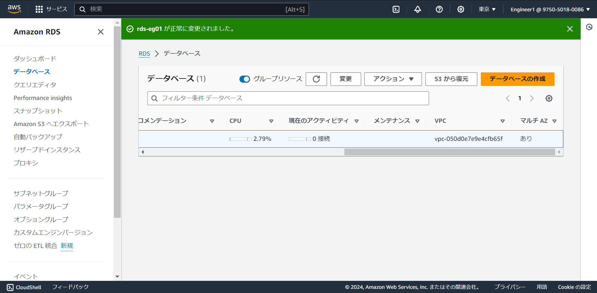

#　今後ã®èª²é¡Œ 
基本的ãªã‚¹ã‚±ãƒ¼ãƒ©ãƒ–ルWebサイトを構築ã§ããŸã€‚
Webサイトã®éƒ¨åˆ†ã‚’CloudFront + S3を使用ã—ãŸé™çš„サイトã«å¤‰ãˆã‚‹ã€ã‚¤ãƒ³ã‚¹ã‚¿ãƒ³ã‚¹-DB部分をDocker + Fargateã«å¤‰ãˆã‚‹ãªã©ã‚¢ãƒ¬ãƒ³ã‚¸ã‚’試ã—ã¦ã¿ãŸã„。
CloudFormation ã§ã‚³ãƒ¼ãƒ‰åŒ–ã™ã‚‹éš›ã«ãƒªã‚½ãƒ¼ã‚¹é¸æŠã™ã‚‹ã®ãŒé¢å€’ã ã£ãŸã®ã§ã€ãƒªã‚½ãƒ¼ã‚¹ã¸ã®ã‚¿ã‚°ä»˜ã‘を今後試ãã†ã¨æ€ã£ãŸã€‚

# å‚考文献
https://pages.awscloud.com/JAPAN-event-OE-Hands-on-for-Beginners-Scalable-2022-confirmation_386.html