## Mermaid 使い方の超要約

* 3バッククオートでコードブロック、言語は `mermaid`。
* 最初の行が図の種類（`flowchart` とか `sequenceDiagram`）。
* 方向は `flowchart TD` みたいに指定（TB/TD/LR/RL/BT）。
* オンラインの Mermaid Live Editor で即実行。 ([mermaid.js.org][1])

### 0) ローカルクイックスタート

0. (前提) `npm`と`Node.js`をインストール。(無理ならブラウザへ。[mermaid.js.org][1])

1. VSCodeで拡張機能を3つ導入。

https://marketplace.visualstudio.com/items?itemName=bierner.markdown-mermaid
https://marketplace.visualstudio.com/items?itemName=bpruitt-goddard.mermaid-markdown-syntax-highlighting
https://marketplace.visualstudio.com/items?itemName=shd101wyy.markdown-preview-enhanced

2. ファイルの拡張子を`.md`にする。

3. ファイルをVSCodeで開き、 Ctrl+Shift+Vでダイアグラムがプレビューされる。

---

### 1) フローチャート（flowchart）

ノードと矢印。迷ったらまずこれ。

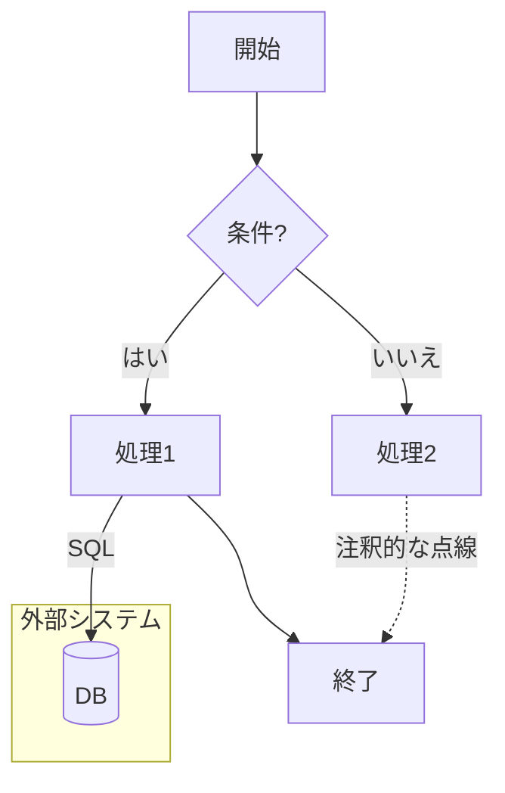

* 角括弧で形変わる：`[長方形]`、`(丸)`、`{ひし形}`、`((円))`、`[(シリンダー=DB)]` など。
* サブグラフは `subgraph ... end`。
* エッジラベルは `-- 文言 -->`。 ([docs.mermaidchart.com][2])

---

### 2) シーケンス図（sequenceDiagram）

やり取りの順番を時系列で殴る。

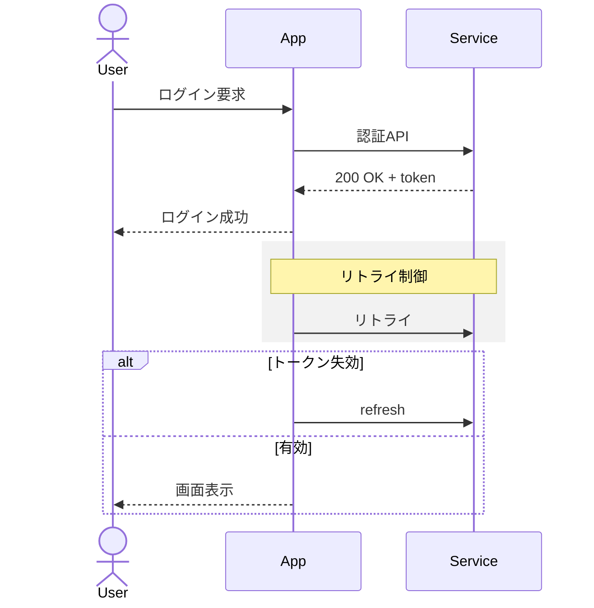

* `actor/participant`、`alt/else/end`、`rect`、`note`、`loop` などが使える。
* `end` という単語は一部環境で衝突するので必要なら括弧などで囲え、という注意がある。 ([docs.mermaidchart.com][3])

---

### 3) クラス図（classDiagram）

関係性の骨組みを素早く書く用。

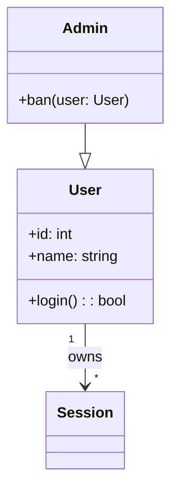

* 可視性 `+/-/#`、関連 `"1" -- "*"`, 継承 `--|>`、実装 `..|>` などが基本。 ([mermaid.js.org][4])

---

### 4) 状態遷移図（stateDiagram）

状態機械を殴る時に。

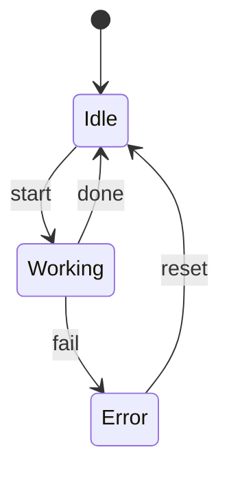

* 初期 `[∗]`、終端 `[∗]`。サブ状態も書ける。 ([mermaid.js.org][4])

---

### 5) ER 図（erDiagram）

データモデルを口頭会議で殴り倒す時用。

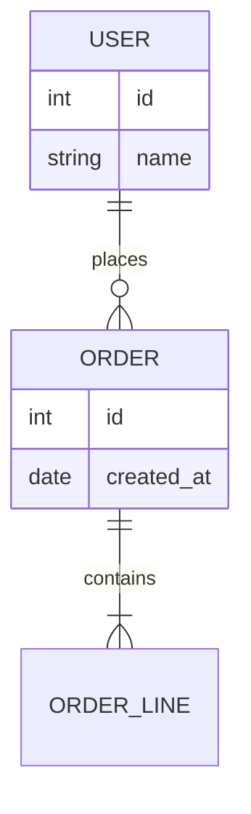

* 関連の多重度 `||--o{` など。テーブル定義風の属性記述ができる。 ([mermaid.js.org][4])

---

### 6) ガントチャート（gantt）

期限の可視化。上司の「いつ終わるの」攻撃を防御。

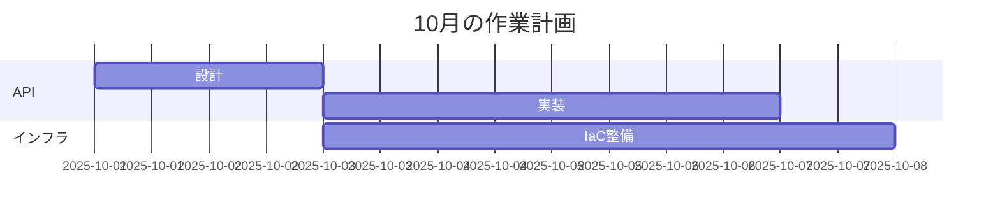

* `dateFormat`、`after` 参照が便利。 ([mermaid.js.org][4])

---

### 7) ユーザージャーニー（journey）

体験フローと感情の起伏。

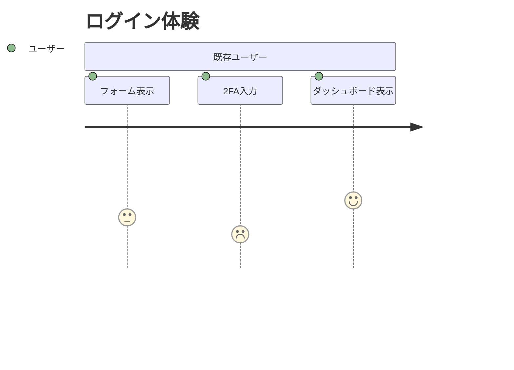

* 数字は満足度。プレゼン用の即席図に良い。 ([mermaid.js.org][4])

---

### 8) 円グラフ（pie）

数字の内訳を雑に見せる時。

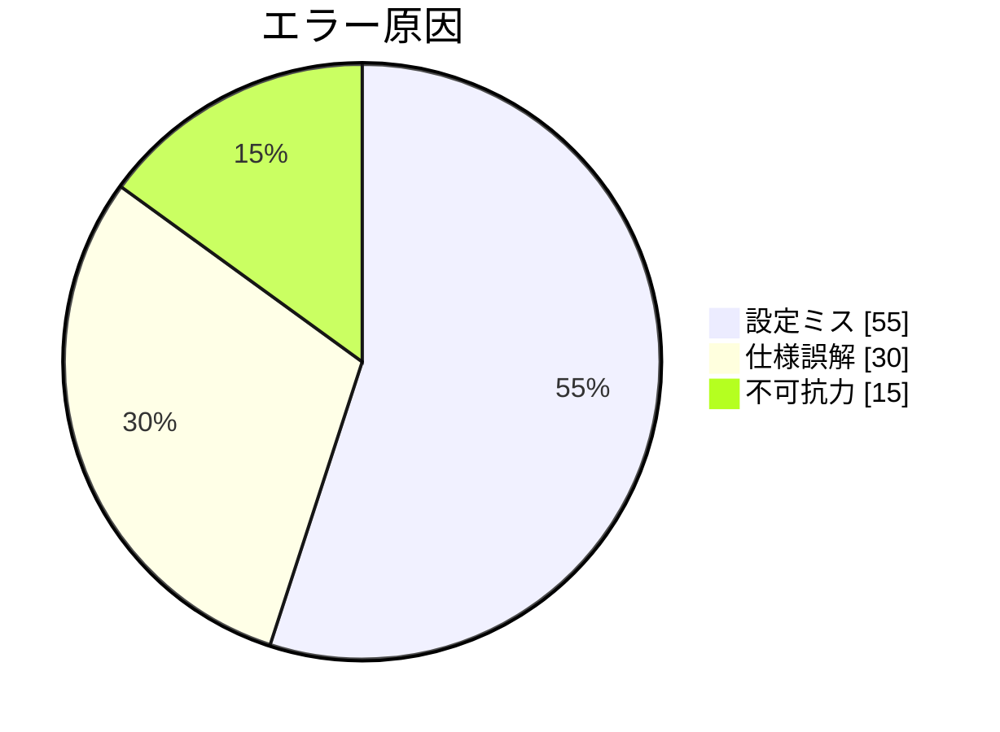

([mermaid.js.org][4])

---

### 9) マインドマップ（mindmap）

ブレストの下書きに最速。

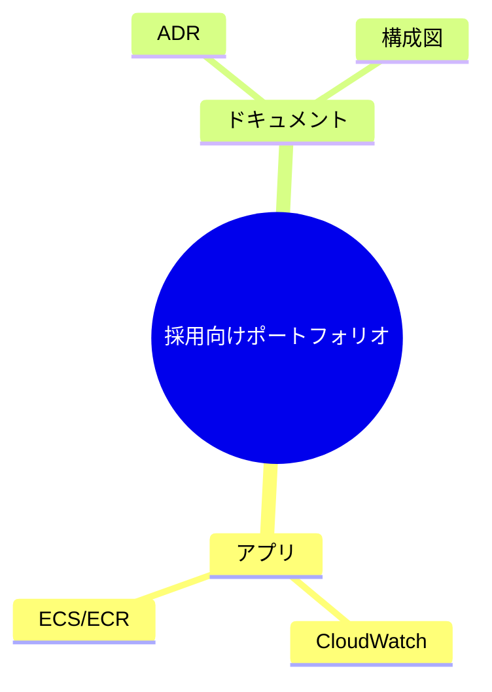

([mermaid.js.org][4])

---

### 10) タイムライン（timeline）

イベントの並びだけ出したい時。

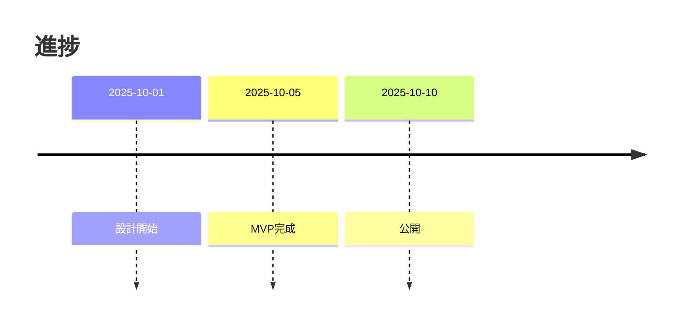

([mermaid.js.org][4])

---

### 11) Git グラフ（gitGraph）

ブランチ戦国時代を可視化。

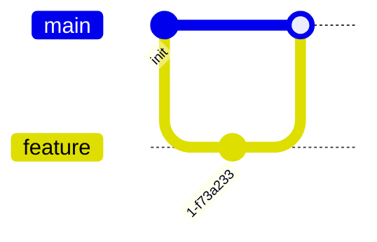

([mermaid.js.org][4])

---

### 12) 要件図・クアドラントなど（requirementDiagram / quadrantChart ほか）

* 要件図は `requirementDiagram`、優先度と検証手段を整理するのに使える。
* クアドラントは `quadrantChart`。2軸マトリックスを一撃で描ける。
* ただし対応状況はレンダラやバージョン依存あり。使う前に公式の「Diagram Syntax」一覧で生存確認してから突撃。C4やSankey等は注意書き付き。 ([mermaid.js.org][4])

---

### よく使う小技

```mermaid
%% コメント
%%{init: {'theme': 'forest'}}%%  %% エディタや埋め込みで初期設定
```

* `%%{init: ...}%%` でテーマや設定を上書き。
* ノードやエッジのスタイル変更は `style id fill:#eee,stroke:#333` みたいに書く。細かいスタイルは SVG 寄りの指定。 ([mermaid.js.org][5])

---

### 公式サイトと Live Editor

まずここで動けばだいたい勝ち。社内 Wiki 連携や拡張（VS Code 拡張など）もあるが、まずはブラウザで確実に通す。 ([mermaid.js.org][1])

---

## 参考（公式ドキュメント）

* Diagram Syntax（総合リファレンス）と各ページ（Flowchart, Sequence, Class…）を叩け。 ([mermaid.js.org][5])

[1]: https://mermaid.live/edit#pako:eNpVjcFOg0AQhl9lMydNaENbCLAHE0u1lyZ66EnoYQIDSyy7ZFlSK_DuLjTGOqeZfN__Tw-Zygk4FGd1yQRqw467VDI7z0ksdNWaGtsTWyyehj0ZVitJ14FtH_aKtUI1TSXLx5u_nSQW94dJI2ZEJT_HG4rn_Jukge2SAzZGNad7cryogb0k1buw9f-J0GRTr0mBvMBFhprFqGcFHCh1lQM3uiMHatI1Tif0E03BCKopBW7XnArsziaFVI421qD8UKr-TWrVlQJs_bm1V9fkaGhXYanxTyGZk45VJw1wf24A3sMX8M0mXPrBOopCz_V91w8DB67WcZdrL4oCb7XaeJElowPf8093GQa-ezer8QfIaHaP "Mermaid | Diagramming and charting tool"
[2]: https://docs.mermaidchart.com/mermaid-oss/syntax/flowchart.html "Flowcharts – Basic Syntax"
[3]: https://docs.mermaidchart.com/mermaid-oss/syntax/sequenceDiagram.html "Sequence diagrams | Mermaid"
[4]: https://mermaid.js.org/syntax/classDiagram.html "Class diagrams"
[5]: https://mermaid.js.org/intro/syntax-reference.html "Diagram Syntax"
