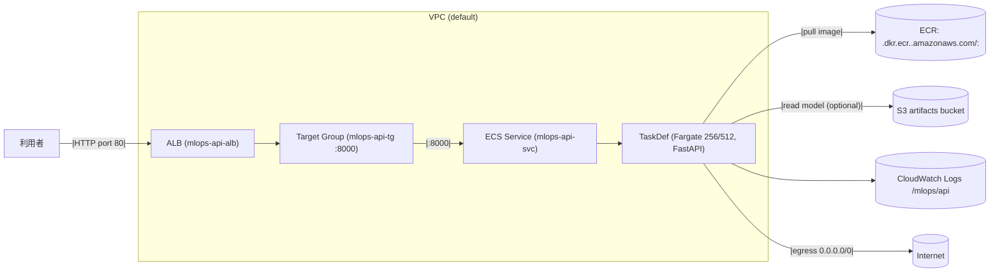
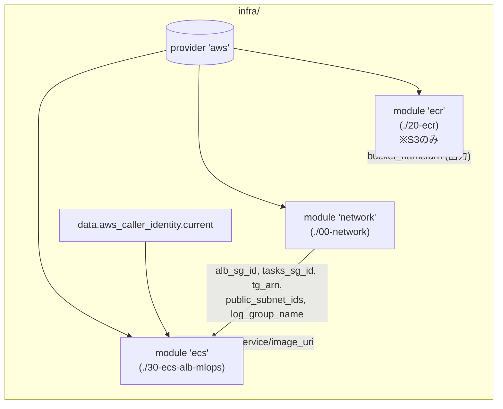
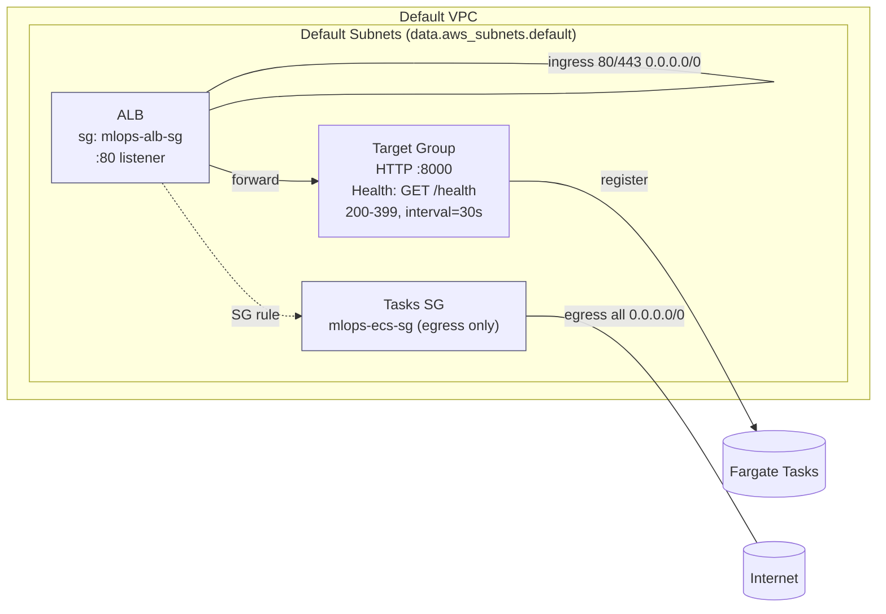
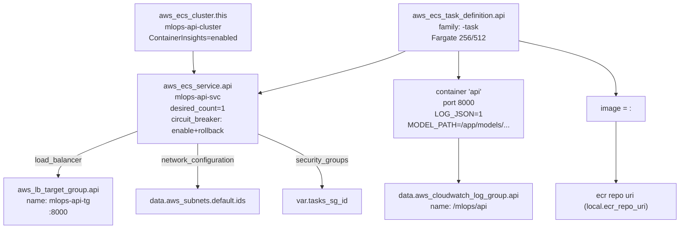
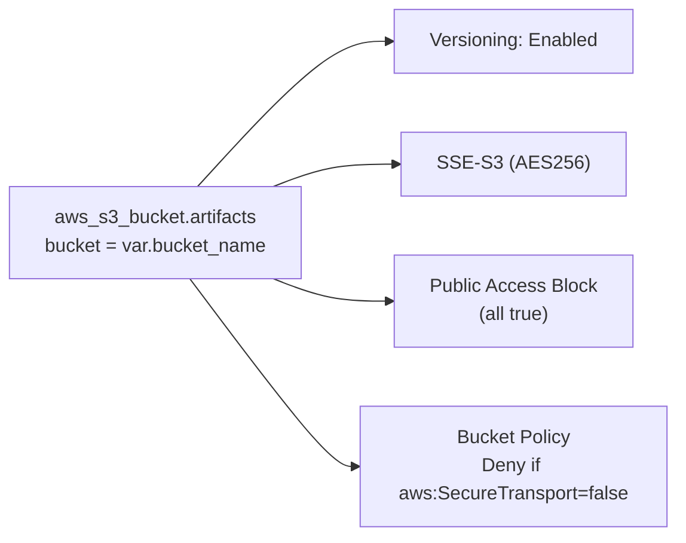
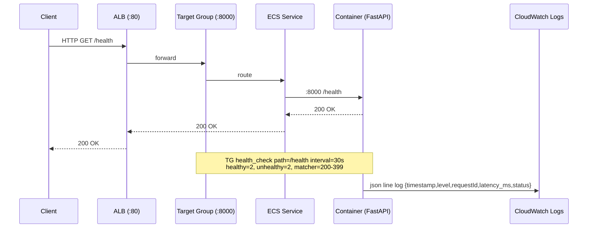

```mermaid
flowchart LR
    Client["利用者"] --|HTTP port 80|--> ALB["ALB (mlops-api-alb)"]
    ALB --> TG["Target Group (mlops-api-tg :8000)"]
    TG --|:8000|--> ECSsvc["ECS Service (mlops-api-svc)"]
    ECSsvc --> Task["TaskDef (Fargate 256/512, FastAPI)"]
    Task --|pull image|--> ECR[(ECR: <account>.dkr.ecr.<region>.amazonaws.com/<repo>:<tag>)]
    Task --|read model (optional)|--> S3[(S3 artifacts bucket)]
    Task --> CWL[(CloudWatch Logs /mlops/api)]
    Task --|egress 0.0.0.0/0|--> Internet[(Internet)]

    subgraph AWS["VPC (default)"]
        ALB
        TG
        ECSsvc
        Task
    end

```

```mermaid
flowchart TB
    subgraph Infra[infra/]
      NET["module 'network'<br/>(./00-network)"]
      ECRMOD["module 'ecr'<br/>(./20-ecr)<br/>※S3のみ"]
      ECSMOD["module 'ecs'<br/>(./30-ecs-alb-mlops)"]
      AWS[(provider 'aws')]
      CID[data.aws_caller_identity.current]
    end

    AWS --> NET
    AWS --> ECRMOD
    AWS --> ECSMOD
    CID --> ECSMOD

    NET -->|alb_sg_id, tasks_sg_id, tg_arn,<br/>public_subnet_ids, log_group_name| ECSMOD
    ECRMOD -->|"bucket_name/arn (出力)"| Infra
    ECSMOD -->|cluster/taskdef/service/image_uri| Infra
```

```mermaid
flowchart LR
    subgraph DefaultVPC[Default VPC]
      subgraph Subnets["Default Subnets (data.aws_subnets.default)"]
        ALB["ALB<br/>sg: mlops-alb-sg<br/>:80 listener"]
        TG["Target Group<br/>HTTP :8000<br/>Health: GET /health<br/>200-399, interval=30s"]
        ECS["Tasks SG<br/>mlops-ecs-sg (egress only)"]
      end
    end

    ALB -- forward --> TG
    TG -- register --> TASKS[(Fargate Tasks)]

    %% SG rule depiction
    ALB ---|ingress 80/443 0.0.0.0/0| ALB
    ECS ---|egress all 0.0.0.0/0| Internet[(Internet)]
    ALB -. SG rule .-> ECS
    classDef sg fill:#eef,stroke:#557,stroke-width:1px;
    class ALB,ECS sg;
```

```mermaid
flowchart TB
    CL["aws_ecs_cluster.this<br/>mlops-api-cluster<br/>ContainerInsights=enabled"]
    TD["aws_ecs_task_definition.api<br/>family: <project>-task<br/>Fargate 256/512"]
    SVC["aws_ecs_service.api<br/>mlops-api-svc<br/>desired_count=1<br/>circuit_breaker: enable+rollback"]
    TG["aws_lb_target_group.api<br/>name: mlops-api-tg<br/>:8000"]
    LGRP["data.aws_cloudwatch_log_group.api<br/>name: /mlops/api"]
    SUB[data.aws_subnets.default.ids]
    TSG[var.tasks_sg_id]
    CN["container 'api'<br/>port 8000<br/>LOG_JSON=1<br/>MODEL_PATH=/app/models/..."]
    ECR["ecr repo uri (local.ecr_repo_uri)"]
    IMG["image = <repo>:<tag>"]

    CL --> SVC
    TD --> SVC
    SVC -->|load_balancer| TG
    TD --> CN
    CN --> LGRP
    TD --> IMG
    IMG --> ECR
    SVC -->|network_configuration| SUB
    SVC -->|security_groups| TSG

```

```mermaid
flowchart LR
    S3["aws_s3_bucket.artifacts<br/>bucket = var.bucket_name"]
    V["Versioning: Enabled"]
    ENC["SSE-S3 (AES256)"]
    PAB["Public Access Block<br/>(all true)"]
    POL["Bucket Policy<br/>Deny if aws:SecureTransport=false"]

    S3 --> V
    S3 --> ENC
    S3 --> PAB
    S3 --> POL
```

```mermaid
flowchart TB
    subgraph Outputs
      o_bucket_name[bucket_name]
      o_bucket_arn[bucket_arn]
      o_region[region]
      o_alb_dns[alb_dns / alb_dns_name]
      o_alb_arn[alb_arn]
      o_tg_arn[tg_arn]
      o_loggrp[log_group_name]
      o_sg_alb[alb_security_group_id]
      o_sg_tasks[tasks_security_group_id]
      o_cluster[cluster_name / ecs_cluster_arn]
      o_taskdef[taskdef_arn]
      o_svc[ecs_service_name]
      o_img[ecr_image_uri]
      o_tfstate[tfstate_bucket, dynamodb_lock_table]
    end

    NET[module.network] --> o_alb_dns
    NET --> o_alb_arn
    NET --> o_tg_arn
    NET --> o_loggrp
    NET --> o_sg_alb
    NET --> o_sg_tasks

    ECRMOD[module.ecr] --> o_bucket_name
    ECRMOD --> o_bucket_arn

    ECSMOD[module.ecs] --> o_cluster
    ECSMOD --> o_taskdef
    ECSMOD --> o_svc
    ECSMOD --> o_img

    VAR[var.region] --> o_region
    CONST["'nickelth-tfstate' / 'tf-lock'"] --> o_tfstate
```

```mermaid
sequenceDiagram
    participant U as Client
    participant A as ALB (:80)
    participant T as Target Group (:8000)
    participant S as ECS Service
    participant C as Container (FastAPI)
    participant L as CloudWatch Logs

    U->>A: HTTP GET /health
    A->>T: forward
    T->>S: route
    S->>C: :8000 /health
    C-->>S: 200 OK
    S-->>A: 200 OK
    A-->>U: 200 OK
    Note over T,C: TG health_check path=/health interval=30s<br/>healthy=2, unhealthy=2, matcher=200-399
    C->>L: json line log {timestamp,level,requestId,latency_ms,status}
```
