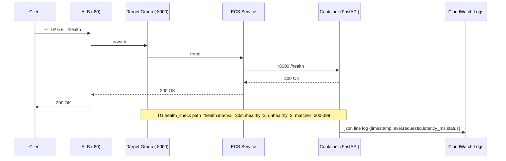

```mermaid
flowchart LR
    Client[利用者] -->|HTTP :80| ALB[ALB (mlops-api-alb)]
    ALB --> TG[Target Group (mlops-api-tg :8000)]
    TG -->|:8000| ECSsvc[ECS Service (mlops-api-svc)]
    ECSsvc --> Task[TaskDef (Fargate 256/512, FastAPI)]
    Task -->|pull image| ECR[(ECR: <account>.dkr.ecr.<region>.amazonaws.com/<repo>:<tag>)]
    Task -->|read model (optional)| S3[(S3 artifacts bucket)]
    Task --> CWL[(CloudWatch Logs /mlops/api)]
    Task -->|egress 0.0.0.0/0| Internet[(Internet)]

    subgraph AWS[VPC (default)]
      ALB
      TG
      ECSsvc
      Task
    end
```

```mermaid
flowchart TB
    subgraph Infra[infra/]
      NET[module "network"\n(./00-network)]
      ECRMOD[module "ecr"\n(./20-ecr)\n※S3のみ]
      ECSMOD[module "ecs"\n(./30-ecs-alb-mlops)]
      AWS[(provider "aws")]
      CID[data.aws_caller_identity.current]
    end

    AWS --> NET
    AWS --> ECRMOD
    AWS --> ECSMOD
    CID --> ECSMOD

    NET -->|alb_sg_id, tasks_sg_id, tg_arn,\npublic_subnet_ids, log_group_name| ECSMOD
    ECRMOD -->|bucket_name/arn (出力)| Infra
    ECSMOD -->|cluster/taskdef/service/image_uri| Infra
```

```mermaid
flowchart LR
    subgraph DefaultVPC[Default VPC]
      subgraph Subnets[Default Subnets (data.aws_subnets.default)]
        ALB[ALB\nsg: mlops-alb-sg\n:80 listener]
        TG[Target Group\nHTTP :8000\nHealth: GET /health\n200-399, interval=30s]
        ECS[Tasks SG\nmlops-ecs-sg (egress only)]
      end
    end

    ALB -- forward --> TG
    TG -- register --> TASKS[(Fargate Tasks)]

    %% SG rule depiction
    ALB ---|ingress 80/443 0.0.0.0/0| ALB
    ECS ---|egress all 0.0.0.0/0| Internet[(Internet)]
    ALB -. SG rule .-> ECS
    classDef sg fill:#eef,stroke:#557,stroke-width:1px;
    class ALB,ECS sg;
```

```mermaid
flowchart TB
    CL[aws_ecs_cluster.this\nmlops-api-cluster\nContainerInsights=enabled]
    TD[aws_ecs_task_definition.api\nfamily: <project>-task\nFargate 256/512]
    SVC[aws_ecs_service.api\nmlops-api-svc\ndesired_count=1\ncircuit_breaker: enable+rollback]
    TG[aws_lb_target_group.api\nname: mlops-api-tg\n:8000]
    LGRP[data.aws_cloudwatch_log_group.api\nname: /mlops/api]
    SUB[data.aws_subnets.default.ids]
    TSG[var.tasks_sg_id]
    CN[container "api"\nport 8000\nLOG_JSON=1\nMODEL_PATH=/app/models/...]
    ECR[ecr repo uri (local.ecr_repo_uri)]
    IMG[image = <repo>:<tag>]

    CL --> SVC
    TD --> SVC
    SVC -->|load_balancer| TG
    TD --> CN
    CN --> LGRP
    TD --> IMG
    IMG --> ECR
    SVC -->|network_configuration| SUB
    SVC -->|security_groups| TSG

flowchart LR
    S3[aws_s3_bucket.artifacts\nbucket = var.bucket_name]
    V[Versioning: Enabled]
    ENC[SSE-S3 (AES256)]
    PAB[Public Access Block\n(all true)]
    POL[Bucket Policy\nDeny if aws:SecureTransport=false]

    S3 --> V
    S3 --> ENC
    S3 --> PAB
    S3 --> POL
```


