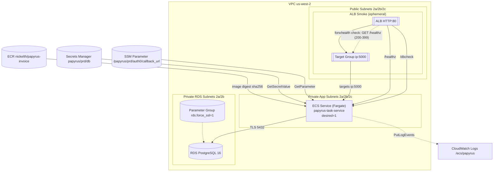

## Papyrus Invoice リポジトリ

@[card](https://github.com/Nickelth/papyrus-invoice)

### はじめに（Purpose）

**PJの目的**: RDSのマスターデータから納品書をPDF出力する最小B2Bワークフローの構築
**評価点**: IaC/観測/証跡/CI
**スコープ内・外**: 含む：ECS/Fargate, RDS, 一時ALBスモーク｜含まない：恒久ALB, 本番SLA

### システム構成（Architecture）

#### コンポーネント一覧

- ECS(Fargate) アプリ
  - 用途: Flaskアプリ（/healthz, /dbcheck）
  - 画像: ECR `nickelth/papyrus-invoice@sha256:…`（digest固定）
  - ポート: 5000/tcp
  - ログ: CloudWatch Logs `/ecs/papyrus`
  - Env/Secret: `PGSSLMODE=require`, SecretsManager `papyrus/prd/db`, SSM `/papyrus/prd/auth0/callback_url`
  - 通信: → RDS(PostgreSQL) 5432/TLS、← ALB(一時) HTTP:80

- RDS (PostgreSQL 16)
  - 用途: 商品マスタ
  - セキュリティ: `rds.force_ssl=1`（ParamGroup）、SGは「ECSタスクSGのみ許可」
  - スキーマ: `papyrus_schema.products`（`init.sql`で適用）
  - 可用性: 非公開サブネット

- 一時 ALB / Target Group（スモーク用）
  - 用途: 外形疎通検証（毎回作成→必ず destroy）
  - ヘルスチェック: `GET /healthz` (200–399), interval 10s, healthy 2/2
  - Listener: HTTP:80 -> TG (ip target, port 5000)
  - サブネット: public subnets (us-west-2a/2b/2c)

- CloudWatch Logs / Alarms
  - Logs: 1行JSON（logger名 `papyrus`、`route`キーを含む）
  - Alarms: ECS Memory>80%(Avg,5m×2) / ALB 5xx>1(Sum,5m×2) / TargetResponseTime p90>1.5s

- Secrets Manager / SSM
  - Secrets: `papyrus/prd/db`（host, port, db, user, password）
  - SSM: `/papyrus/prd/auth0/callback_url`（アプリ設定）

#### データフロー

- Web→ALB→TG→ECS→RDS の順で、主要リクエスト：`/healthz` `/dbcheck`
- 出力（PDF/ログ/証跡）の流れ：
    - PDF: ブラウザのPDF保存画面に遷移するためローカル保存
    - ログ/証跡: CIで自動コミット / CloudShellで手入力

#### セキュリティ境界

* VPCセグメント／プライベートサブネット
* SGルール（ECS→RDSのみ許可、CIDR解放なし）
* `rds.force_ssl=1`/`PGSSLMODE=require`

### 開発・運用ポリシー

#### 完成定義（Definition of Done）

- ECS→RDS の疎通 OK

- RDSに最小スキーマを適用済み

- CloudWatch Logs に構造化ログを出力（JSON1行）

- IaC 薄切り (RDS/SG/ParameterGroup だけTerraform化。完全Importは後回し)

- 証跡：`psql` 接続ログ、SG設定SS、アプリログに接続成功 

- Parameter Group反映

- CLI履歴の証跡化

#### 証跡運用（docs/evidence）

- **タイムスタンプ**：`YYYYMMDD_HHMMSS`（例: `20260101_012345`）
- **種別（例）**：

    - `healthz.log` / `dbcheck.log`（HTTP生ログ）
    - `cloudwatch_healthz.json` / `cloudwatch_dbcheck.json`（AWS CLI生JSON）
    - `healthz_json_line.log` / `dbcheck_json_line.log`（JSON 1行だけ抜粋）
    - `listeners.json` / `tg_health.json`（ALB配線ダンプ）
    - `alb_plan.log` / `alb_apply.log` / `alb_destroy.log`（Terraformログ）
- **例**：

    - `20260101_012345_healthz.log`
    - `20260102_231010_cloudwatch_dbcheck.json`
    - `20260103_070809_dbcheck_json_line.log`

- **PRブランチ名**：
    - `evidence/smoke-<YYYYMMDD-HHMMSSZ>`（例：`evidence/smoke-20251105-063210Z`）

- **マスク指針**（自動 or 手動で置換）：

    - RDSエンドポイント：`****.****.us-west-2.rds.amazonaws.com`
    - アカウントID：`************`
    - シークレット値：出さない（値は出力しない設計に）

### 依存関係と前提

- AWSリージョン: `us-west-2`
- 必要IAMロール 
    - GitHub OIDC 実行ロール
    - 目的: CI/CD（ECR push, ECS deploy, 一時ALB/TG, CloudWatch/CloudTrail読取）
    - 主要権限:
        - ECR: ecr:BatchGetImage, ecr:PutImage, ecr:GetAuthorizationToken
        - ECS/ELBv2/EC2(Describe系): ecs:*, elasticloadbalancing:*, ec2:Describe*
        - CloudWatch Logs(読取): logs:FilterLogEvents, logs:Describe*
        - CloudTrail(読取/監査WF用): cloudtrail:LookupEvents
        - Terraform適用で必要な create/update/delete（20-alb スコープ）※最小に絞る

    - ECS Execution Role
    - 目的: タスク起動時に**イメージ取得・ログ出力・Secrets取得**
    - 主要権限:
        - ECR 読取: ecr:GetAuthorizationToken, ecr:BatchGetImage
        - CW Logs 書込: logs:CreateLogStream, logs:PutLogEvents
        - Secrets 読取: secretsmanager:GetSecretValue（`papyrus/prd/db` 限定）
        - KMS 復号（必要なら）: kms:Decrypt（SecretsのKMSキー限定）

    - ECS Task Role
    - 目的: アプリ実行時に外部サービスへアクセス
    - 主要権限:
        - SSM パラメータ読取: ssm:GetParameter（`/papyrus/prd/*` 限定）
        - ※RDSは**SGで許可**するのでIAM権限は不要

- GitHub Actions 
    - Secrets
        - `AWS_ACCOUNT_ID`
        - `AWS_IAM_ROLE_ARN`  (例: `arn:aws:iam::<acct>:role/ECRPowerUser`)
        - `ECS_TASK_SG_ID`    (例: `sg-xxxxxxxxxxxxxxxxx`)
        - `PUBLIC_SUBNET_IDS` (例: `["subnet-aaa","subnet-bbb","subnet-ccc"]`)
        - `VPC_ID`            (例: `vpc-xxxxxxxxxxxx`)
    - Vars
        - `AWS_REGION`=`us-west-2`
        - `CONTAINER_NAME`=`papyrus-app`
        - `CONTAINER_PORT`=`5000`
        - `ECR_REPOSITORY`=`nickelth/papyrus-invoice`
        - `ECS_CLUSTER`=`papyrus-ecs-prd`
        - `ECS_SERVICE`=`papyrus-task-service`
        - `TASK_FAMILY`=`papyrus-task`
    - Permissions
        - `permissions: { id-token: write, contents: write, pull-requests: write }`

- 開発PC要件：
  - Python 3.12.3+
  - jq 1.7+
  - Git 2.43.0+
- CloudShell: 
  - jq 1.7+ 
  - rsync 3.4.0+ 
  - terraform 1.13.2+
  - awscli 2.31.0+

### リポジトリ構成

**主要ディレクトリの役割**

- `infra/10-rds`: RDS構築用IaC (Terraform)
- `infra/20-alb`: 一時ALB用IaC (Terraform)
- `infra/30-monitor`: CloudWatch Alarm 構築IaC (Terraform)
- `docs/evidence`: 証跡保管部
- `papyrus/…`: アプリ動作部
- `papyrus/blueprint`: ALB/RDS疎通ヘルスチェック

### 今後の拡張方針

* 恒久ALB化の判断基準
* sslrootcert厳格化
* 本番SLAとスケール戦略

### 付録：用語集

* ECS/Fargate、TaskDef、TargetGroup、Digest固定、観測の入口…を一行定義

