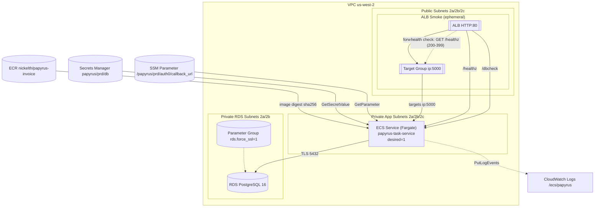

## Papyrus Invoice リポジトリ

@[card](https://github.com/Nickelth/papyrus-invoice)

### はじめに（Purpose）

RDS 上のマスターデータを元に納品書 PDF を生成する、最小構成の B2B ワークフローを構築。
本プロジェクトでは、インフラのコード化（IaC）、可観測性、証跡運用、CI 連携を重視。
スコープは「ECS/Fargate + RDS + 検証用の一時 ALB」までとし、本番相当の恒久 ALB や SLA 設計は対象外とする。

### システム構成（Architecture）

#### コンポーネント一覧

- ECS(Fargate) アプリ
  - 用途: Flask 製のバックエンド API。RDS から商品マスタを取得し、納品書 PDF を生成する。
  - 特徴:
    - Immutable な Docker イメージ（ECR の digest 固定）をデプロイ
    - `/healthz` `/dbcheck` エンドポイントで ALB / RDS の疎通を確認
    - CloudWatch Logs に JSON 1 行形式でアプリログを出力
    - DB 接続情報や外部サービスの設定は Secrets Manager / SSM から参照

- RDS (PostgreSQL 16)
  - 用途: 商品マスタ
  - セキュリティ: `rds.force_ssl=1`（ParamGroup）、SGは「ECSタスクSGのみ許可」
  - スキーマ: `papyrus_schema.products`（`init.sql`で適用）
  - 可用性: 非公開サブネット

- 一時 ALB / Target Group（スモーク用）
  - 用途: 外形疎通検証（毎回作成→必ず destroy）
  - ヘルスチェック: `GET /healthz` (200–399), interval 10s, healthy 2/2
  - Listener: HTTP:80 -> TG (ip target, port 5000)
  - サブネット: public subnets (us-west-2a/2b/2c)

- CloudWatch Logs / Alarms
  - Logs: 1行JSON（logger名 `papyrus`、`route`キーを含む）
  - Alarms: ECS Memory>80%(Avg,5m×2) / ALB 5xx>1(Sum,5m×2) / TargetResponseTime p90>1.5s

- Secrets Manager / SSM
  - Secrets: `papyrus/prd/db`（host, port, db, user, password）
  - SSM: `/papyrus/prd/auth0/callback_url`（アプリ設定）

#### データフロー

- Web→ALB→TG→ECS→RDS の順で、主要リクエスト：`/healthz` `/dbcheck`
- 出力（PDF/ログ/証跡）の流れ：
    - PDF: ブラウザのPDF保存画面に遷移するためローカル保存
    - ログ/証跡: CIで自動コミット / CloudShellで手入力

#### セキュリティ境界

* VPCセグメント／プライベートサブネット
* SGルール（ECS→RDSのみ許可、CIDR解放なし）
* `rds.force_ssl=1`/`PGSSLMODE=require`

### 開発・運用ポリシー

#### 完成定義（Definition of Done）

- ECS→RDS の疎通 OK

- RDSに最小スキーマを適用済み

- CloudWatch Logs に構造化ログを出力（JSON1行）

- RDS / SG / Parameter Group など影響範囲を限定した IaC からTerraformを導入
 - 既存リソースの完全 Import は段階的に進める方針

- 疎通確認・パラメータ反映・ログ出力が揃い、証跡が docs/evidence に残っていること

- Parameter Group反映

#### 証跡運用（docs/evidence）

監査や振り返りに備え、疎通確認・Terraform 実行ログ・ALB/TG 設定・CloudWatch ログなどを docs/evidence 配下にタイムスタンプ付きで保存。

RDS エンドポイントやアカウント ID、シークレット値などを、マスクルールを決めて自動・手動で匿名化してからコミット。

### 依存関係と前提

- AWSリージョン: `us-west-2`
- 必要IAMロール 
  - ECS/ALB: サービス更新・ターゲットグループ操作など、デプロイに必要なアクションに限定
  - EC2: Describe 系のみ

- GitHub Actions：
  - AWS アカウント情報・VPC/サブネット/SG ID は Secrets / Vars で管理
  - 環境依存の値（リージョン、ECS クラスタ名、ECR リポジトリ名など）はすべて Vars に集約

- CloudShell に AWS CLI / Terraform / jq 等を入れて作業

### リポジトリ構成

**主要ディレクトリの役割**
- infra 以下: 
  - 目的ごとに薄切りでディレクトリ分割。
  - RDS / 一時 ALB / 監視の IaC を独立して管理。

- `infra/10-rds`: RDS構築用IaC (Terraform)
- `infra/20-alb`: 一時ALB用IaC (Terraform)
- `infra/30-monitor`: CloudWatch Alarm 構築IaC (Terraform)
- `docs/evidence`: 証跡保管部
- `papyrus/…`: アプリ動作部
- `papyrus/blueprint`: ALB/RDS疎通ヘルスチェック

### 今後の拡張方針

* 恒久ALB化の判断基準
* sslrootcert厳格化
* 本番SLAとスケール戦略

### 付録：用語集

* ECS/Fargate、TaskDef、TargetGroup、Digest固定、観測の入口…を一行定義

