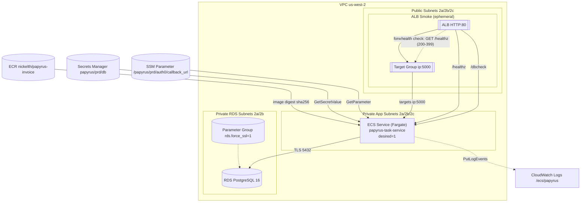

### 付録：用語集

* ECS/Fargate、TaskDef、TargetGroup、Digest固定、観測の入口…を一行定義

```mermaid
flowchart TB
  %% peripherals
  ECR[(ECR nickelth/papyrus-invoice)]
  CW[CloudWatch Logs /ecs/papyrus]
  SM[(Secrets Manager papyrus/prd/db)]
  SSM[(SSM Parameter /papyrus/prd/auth0/callback_url)]

  %% VPC
  subgraph VPC["VPC us-west-2"]
    direction TB

    subgraph PUB["Public Subnets 2a/2b/2c"]
      direction LR
      subgraph ALBBOX["ALB Smoke (ephemeral)"]
        ALB[[ALB HTTP:80]]
        TG[[Target Group ip:5000]]
      end
      ALB -->|forward| TG
      ALB -. health check: GET /healthz (200-399) .-> TG
    end

    subgraph APP["Private App Subnets 2a/2b/2c"]
      ECSsvc["ECS Service (Fargate)\npapyrus-task-service\ndesired=1"]
    end

    subgraph DB["Private RDS Subnets 2a/2b"]
      RDS[(RDS PostgreSQL 16)]
      PG[(Parameter Group rds.force_ssl=1)]
      PG -.-> RDS
    end
  end

  %% flows
  ECR -->|image digest sha256| ECSsvc
  SM -->|GetSecretValue| ECSsvc
  SSM -->|GetParameter| ECSsvc
  ECSsvc -. PutLogEvents .-> CW

  TG -->|targets ip:5000| ECSsvc
  ALB -->|/healthz| ECSsvc
  ALB -->|/dbcheck| ECSsvc
  ECSsvc -->|TLS 5432| RDS
```